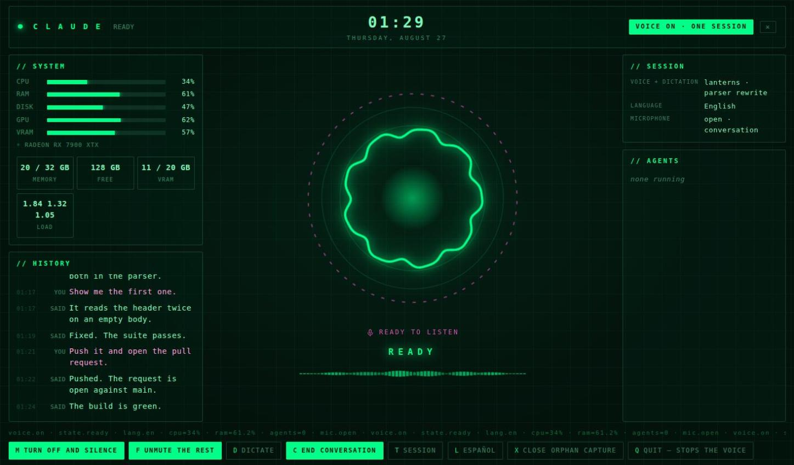

# claude-voice

[](https://github.com/jcarranz97/claude-voice/actions/workflows/ci.yml)

Give Claude Code a voice, an ear, and a status display — locally, with no
cloud speech services.

It hooks into Claude Code and does five things:

- 🔊 **Speaks** a one-line summary at the end of every turn, in a local neural
  voice (Piper). Not the response body — a line the model writes *for the ear*.
- 📻 **Narrates** progress mid-turn, so a five-minute task is not five minutes of
  silence.
- 🫀 **Ticks** softly while it works, with a *different* tick when subagents are
  the ones working.
- 👂 **Listens** — push-to-talk dictation, or continuous conversation mode with
  end-of-turn detection, delivered straight into your running Claude session.
- 📜 **Remembers what was said out loud**, both sides, so you can read back the
  line you missed without leaving the HUD.

And a HUD — a frameless window that shows all of it at a glance, and answers the questions you would otherwise ask by squinting at a terminal: is it listening, is it about to speak, is anything actually running.


Everything runs on your machine. No audio leaves it.

## 🚀 Quickstart

Linux only for now ([why](#where-it-runs)). Three commands.

```bash
# 1. system packages — yours to install; nothing here runs sudo for you
sudo apt install alsa-utils pipewire-bin python3-gi gir1.2-webkit2-4.1
#   Fedora:  sudo dnf install alsa-utils pipewire-utils python3-gobject webkit2gtk4.1
#   Arch:    sudo pacman -S alsa-utils pipewire python-gobject webkit2gtk-4.1

# 2. everything else: the program, a voice, the config, the hooks
curl -fsSL https://raw.githubusercontent.com/jcarranz97/claude-voice/main/install.sh | bash
#   ... | bash -s -- --preset es      for Spanish (es_MX)

# 3. turn the voice on — off is the default, always
claude-voice on
```

Then start your session with `claude-voice` instead of `claude`:

```bash
claude-voice                 # opens the HUD, and gives the ear somewhere to type
claude-voice --model opus    # arguments go straight through to claude
```

That is all of it. No clone, no tmux, no configuration to write first, and nothing to paste into `~/.claude/settings.json` — the script merges the four hooks in and keeps whatever was already there.

Two things it deliberately does not do: install system packages, which is step 1 above and stays yours to run, and turn the voice on, which is step 3 and stays a thing you ask for.

When something is wrong, `claude-voice doctor` says what — it checks the voice model, the audio session, and every hook.

| If you want | Go to |
|---|---|
| what each install step actually does | [Install, in detail](#install) |
| the commands you will use daily | [Running it](#running) |
| the window, dictation, conversation mode | [The HUD](#hud) |
| to change the voice, language or panels | [Configuration](#config) |
| it installed but says nothing | [Troubleshooting](#troubleshooting) |
| why any of it is built this way | [Why the design is the way it is](#design) |
| to change the code | [Development](#development) |

---

<a id="screenshots"></a>

## ✨ What it looks like

The reactor carries the state, and only the state: the instrument panel around it never changes colour, because a window whose chrome dims when nothing is happening reads as a window that is broken.

**Speaking.** Amber, and the reactor moves to the voice itself — it swells on a vowel, spikes on a stressed syllable and falls into the gaps between words, so a two-word answer and a long one no longer look the same. The line it is saying is written underneath.


**Listening.** Conversation mode is armed — the dashed ring — and you are talking right now, with the reactor following how loudly. The microphone badge has its own colour, because the ear being open is not a state of Claude's, and confusing the two is how you end up talking to a window that stopped listening ten minutes ago.


**Armed and quiet.** The same ring, the badge reading `ready to listen`. This is the state that used to be invisible: microphone open, nothing arriving, indistinguishable from the mode being off.



**How it follows the voice.** The two directions are not the same problem, and only one of them is hard. A line being spoken is a finished file before a sample of it is played, so its shape is known in advance: the player measures it once, publishes the envelope with the moment playback started, and every window draws it off the clock. Nothing is streamed and nothing can drift — a window opened mid-sentence catches up on the right syllable. The microphone has no such luxury, so its level is published as it is heard, about twenty-five times a second, and the reactor rises fast and falls slowly the way an ear does rather than the way a graph does. Both are advisory: a window that cannot read either still animates, it just animates blind, which is what it did before.

**Agents.** Waiting on subagents looks the same as thinking from the inside, but it is not the same thing — if agents are out, the wait has an owner. Each one gets a small reactor of its own, in orbit around the main one, so the count is something you read rather than something you tally; the panel beside it names what each is doing.


There is a second surface for the same HUD, drawn out of ring glyphs in a terminal, for a machine with no desktop:

```
                          C L A U D E
                          VOICE ON
  m: turn OFF and silence · d: dictate · c: conversation · l: Español · h: history · q: quit

                              ·  ·  ·
                        ○              ○
                    ◦     T H I N K I N G    ◦
                        ○              ○
                              ·  ·  ·
                     ▁▂▅▇▆▃▂▁▂▄▆▇▅▃▁▂▃▅▄▂▁

                        dictation → myrepo · fixing the parser
                   «Done, the tests pass.»
```

Both read the same module, so they cannot disagree about what is on screen — only about how it is drawn.

---

<a id="install"></a>

## 📦 Install, in detail

### 1. System packages

Nothing here is installed for you — these are your package manager's, and a
script that runs `sudo` on your behalf is not a thing this project does.
The script checks for them and names the ones you are missing, with the
command for your distribution, before it does anything else.

Python is **not** among them: [uv](https://docs.astral.sh/uv/) brings its own.

```bash
# Debian / Ubuntu
sudo apt install alsa-utils pipewire-bin python3-gi gir1.2-webkit2-4.1

# Fedora
sudo dnf install alsa-utils pipewire-utils python3-gobject webkit2gtk4.1

# Arch
sudo pacman -S alsa-utils pipewire python-gobject webkit2gtk-4.1
```

What each one is for, so you can leave out what you do not want:

| Package | For | Needed? |
|---|---|:---:|
| `alsa-utils` | `aplay` to play, `arecord` to record | ✅ always |
| `pipewire-bin` | `pw-record`, for conversation mode | ⚠️ the ear |
| `python3-gi` + `gir1.2-webkit2-4.1` | the frameless HUD window | ➖ optional |

Without the last two the HUD falls back to a Chromium app window, which needs
nothing installed and renders identically — it just keeps a title bar. Without
`pipewire-bin` the voice still works; conversation mode does not.

tmux is deliberately absent from that list. Dictation types into a session
started with `claude-voice`, which needs nothing installed — see
[Do I have to run Claude Code inside tmux?](#do-i-have-to-run-claude-code-inside-tmux)

### 2. Everything else

```bash
curl -fsSL https://raw.githubusercontent.com/jcarranz97/claude-voice/main/install.sh | bash
```

One command, from any directory, with nothing cloned. It installs `uv` if you do not have it, installs the program, downloads a Piper voice, writes a starter config, synthesizes the cached acknowledgements and the heartbeat sounds, and merges the hooks into `~/.claude/settings.json`. Everything it does is to your home directory; it never asks for `sudo`, which is why step 1 is a step of yours.

```bash
curl -fsSL .../install.sh | bash -s -- --preset es    # Spanish (es_MX)
curl -fsSL .../install.sh | bash -s -- --no-hooks     # print them, do not install them
```

Run it again whenever you like: an existing config is left alone, a voice already downloaded is not fetched twice, and hooks already installed are reported rather than added again.

**The program on its own**, if you would rather do the rest by hand:

```bash
uv tool install claude-voice
```

That is the whole program, voice and ear both. It is an application on your machine, not a checkout: nothing is left pointing at a source tree, and you can use it in any directory. What it does *not* get you is a voice — Piper does not ship one inside the package, and without one there is nothing to speak with. `claude-voice lang --fetch en` downloads it, which is the part of the script worth having.

**There is nothing behind a flag.** The ear used to be an `stt` extra, and `claude-voice[stt]` still works so that anything written down against it keeps working — it just installs what the bare name installs. The extra bought a smaller install and sold a failure worth more than the disk it saved: extras are not remembered across reinstalls, so one that forgot to name it took the microphone away silently, and the program went on speaking until the next time you pressed `c` and it said there was no module named faster_whisper.

**From a clone**, which installs the working tree instead of the published package, and says which it did:

```bash
git clone https://github.com/jcarranz97/claude-voice
cd claude-voice
./install.sh                 # a copy of the tree, as it is right now
./install.sh --editable      # ... or the tree itself, edits and all
```

`--editable` is the one to use if you are going to change something — see [Development](#development).

### 3. The hooks

The script installs them. It **merges** rather than pastes: the four entries are added to `~/.claude/settings.json`, everything already in that file stays, and the copy it replaced is kept next to it with a timestamp. An event already hooked to us is left exactly as it is, so running it again after an upgrade adds only what is new. A settings file it cannot parse is refused rather than repaired — it prints the snippet instead and changes nothing.

Doing it yourself is still a supported path, and the only one for a project's `.claude/settings.json`:

```bash
claude-voice hooks              # print the snippet, paste it yourself
claude-voice hooks --install    # merge it into ~/.claude/settings.json
```

Updating an existing install? Run `--install` again — the snippet gains hooks over time, and a missing one costs you a feature rather than breaking the voice. `claude-voice doctor` names the one you are missing and what it does.

<details>
<summary>What the hooks do</summary>

| Hook | Command | What it does |
|---|---|---|
| `SessionStart` | `claude-voice hook session-start` | Notes which terminal the conversation is in — a tmux pane, or the pty it was started on — before it has said anything |
| `UserPromptSubmit` | `claude-voice hook user-prompt-submit` | Injects the TTS instruction, plays an acknowledgement, starts the heartbeat |
| `MessageDisplay` | `claude-voice hook message-display` | Speaks progress between tool calls (optional) |
| `Stop` | `claude-voice hook stop` | Speaks the `<!-- TTS: -->` line, stops the heartbeat |

The commands carry no paths, so reinstalling or upgrading does not break them.
Older installs wrote an interpreter and a script path into each one; those
still work, and `claude-voice doctor` will point them out rather than wait for
the day a moved checkout makes them go quiet. `--install` counts them as
installed and leaves them alone — adding ours beside one would run the hook
twice, which for `Stop` means saying the same line twice.

Drop the `MessageDisplay` entry if you only want the final line spoken.

`SessionStart` is what lets a pane name its conversation. A window that has not exchanged anything yet still carries the default `Claude Code` title and has no transcript to match it against, so without the binding the very first dictated line of a conversation has no session to be filed under and never reaches the history panel. It costs nothing and says nothing; it writes one small file.

</details>

### 4. Turning it on

```bash
claude-voice on              # off is the default, always
claude-voice                 # start a session; the HUD opens with it
```

The installer does not do this one. Off is the default the whole program is built around — while it is off the hook injects nothing, so a machine that installed this and never asked for it spends no tokens and makes no sound.

### Installing it again, from your own checkout

`uv tool install` copies the code into the tool's own environment. It is not a link back to the source tree — that is the point of [Everything else](#2-everything-else) above, and it is also the thing that catches you out the first time you edit the checkout and nothing changes. The installed program keeps running the code it was built from until you replace it, and replacing it takes both flags:

```bash
uv tool install --force --refresh "$HOME/repos/claude-voice"   # wherever yours lives
```

None of this applies to an `--editable` install, which is a pointer at your working tree rather than a copy of it — [Development](#development) is where that lives, and it is the better answer if you are changing the code rather than installing it once.

`--refresh` is the one that matters and the one everybody leaves out. uv caches the wheel it built for a directory, so `--force` on its own reinstalls that cached wheel — your edits are not in it. What makes this worth a section of its own is that nothing complains: the command prints `Installed 1 executable: claude-voice` and exits zero, having installed the same code as before. Without `--force` you get the identical misleading success.

**So which one is installed?** Not a question the version answers: it stays at whatever `pyproject.toml` says across every commit, so `uv tool list` prints the same number before and after. Compare the files.

```bash
diff -rq ~/repos/claude-voice/claude_voice \
  ~/.local/share/uv/tools/claude-voice/lib/python3*/site-packages/claude_voice \
  | grep -v __pycache__
```

Silence means the install matches your working tree, and the command above is the fix for anything else. It compares against the files on disk and nothing more — whether *those* are current is what `git status` and a `git fetch` are for.

---

<a id="running"></a>

## ▶️ Running it

There are **two separate things**, and confusing them is the usual first
stumble:

| | who starts it | where it lives |
|---|---|---|
| **The voice** (speaking, narration, tick) | Claude Code, via the hooks | inside your Claude session — but only while a HUD is open |
| **The HUD** | **you**, or the first session you start | a long-lived process of its own, one for every session |

`claude-voice` starts the session, opens a HUD if none is open, and gives the
ear somewhere to type. Run it in a second terminal and the second session
attaches to the same window — there is only ever one.

The HUD is the application. While one is open, the hooks speak; while none is,
nothing of ours runs at all — nothing spoken, no acknowledgement, no heartbeat,
no microphone held open, and no instruction added to your prompts, so a machine
with no window open is not spending tokens on lines nobody will hear.

Closing the window closes the rest of it: conversation mode is stopped, the
microphone is released, anything queued or playing is cut. And because the exit
that matters most is the one nobody gets to clean up after — a killed terminal,
a machine losing power — the microphone daemon and the heartbeat also check for
themselves, on the timer they already run on, and stop within seconds of the
last window going away.

Closing does not turn the voice **off**, it suspends it. Open a HUD again and it
picks up where the switch left it, with no keys pressed.

### Day to day

```bash
claude-voice                               # start a session the ear can type into
claude-voice --model opus                  # ... arguments go straight to claude
claude-voice sessions                      # what each open session is doing right now
claude-voice on                            # start speaking (off is the default)
claude-voice off                           # stop, and silence anything playing now
claude-voice focus                         # only this session speaks, the rest go quiet
claude-voice focus --clear                 # give every session its voice back
claude-voice mute                          # mute just this one session
claude-voice silence                       # panic button: cut all sound now
claude-voice status                        # is it on? which session does it speak in?
claude-voice lang                          # which language speaks, and what else is here
claude-voice lang en                       # switch to it — the same thing l does in the HUD
claude-voice lang --fetch en               # download that language's voice first

claude-voice hud                           # the status window
claude-voice hud --terminal                # ... in a terminal, for a box with no desktop
claude-voice monitor                       # what has the microphone and speakers — anyone's
claude-voice monitor --watch               # ... live, until you quit
claude-voice history 20                    # the last 20 lines of this conversation
claude-voice history 20 --all              # ... of every session on this machine
claude-voice say "test one two"            # synthesize and play, ignoring the switch
claude-voice ack "and now the tests"       # the acknowledgement for that prompt, printed
claude-voice config                        # what is actually in effect, and from where
claude-voice doctor                        # check the install and say what is wrong
claude-voice --help                        # everything, grouped
```

`doctor` is the one to reach for when something is off. It checks the
interpreter, the voice model, the audio session, whether the hooks are
installed and still point at files that exist, and reports the optional
speech-to-text pieces as notes rather than failures:

```
[  ok  ] piper-tts — importable
[  ok  ] voice model — en_US-amy-medium.onnx (63 MB)
[ FAIL ] hook Stop — points at a missing file: /old/path/speak.py
         fix: claude-voice hooks   (the checkout moved — replace the old line)
[ note ] switch — off
         fix: claude-voice on
```

### One session at a time

The switch is one file for the whole machine, which is the right grain until
three windows are open and all three want to tell you what they just did.
Turning the voice off to stop two of them stops the third as well.

`f` in the HUD, or `claude-voice focus` inside a session, hands the voice to
one pane. That session speaks; the others behave exactly as though the voice
were off, without anything being turned off and without touching those windows
at all. Pressing `f` again, or `claude-voice focus --clear`, gives everyone
their voice back.

Focus and dictation are moved together on purpose. `f` focuses the session
dictation is already aimed at, `t` carries the focus along when it switches
session, and `claude-voice focus` aims dictation at the pane it was run in — so
the window you talk to and the window that answers out loud are one window, not
two settings that happen to agree.

It is filed under the terminal rather than the session id, which is what makes
it survive: closing a conversation and starting another one in the same window
keeps the voice where you put it, and so does quitting the HUD, and so does a
reboot. A session id would not — a restarted session is a new one, and the
focus would quietly fall off it, which is the moment every other window starts
talking again.

"The terminal" is the tmux pane (`%12`) for a session in one, and the
controlling pty (`pts:/dev/pts/3`) for a session started with `claude-voice
run`. A hook inside the session finds its own either way — `$TMUX_PANE` when
there is one, and otherwise `$CLAUDE_PID` read back through `/proc`, because a
hook has no controlling terminal of its own to ask about.

Two consequences worth knowing. A focus left on a window you have since closed
means nothing speaks anywhere; the HUD says so on its bottom line and `f`
clears it. And because pane ids belong to a tmux server, a focus set under a
server that has since been restarted is ignored rather than applied to whatever
pane inherited the number.

<a id="hud"></a>

### 🖥️ The HUD

Open it and leave it up:

```bash
claude-voice hud
```

That is a frameless window: a real reactor with a real glow, system meters —
CPU, memory, disk, and the graphics card's load and VRAM, named by its actual
board — the spoken log down the left and whatever is running down the right. It is not a
browser tab — see below for what it actually opens in.

**The repo panel** names what the watched session is working on: the repository, the branch, the pull request that branch has open, and the state of its checks — how many passing, how many running, and the names of the ones that failed. It is there for the ten minutes after a push, when the only question in the room is whether the thing went green and the answer otherwise costs another window. The branch is read off disk and is always current; the rest comes from `gh` on a slow clock — about once a minute, every twelve seconds while something is still running — asked in the background, so a slow network can make that row late but can never make the window stutter. No repository, no `gh`, no pull request: the rows that have no answer are not drawn, and `hud.github = false` turns the GitHub half off entirely. The terminal HUD says the same thing on its top row.

Worth an alias, since you will open it constantly:

```bash
echo "alias hud='claude-voice hud'" >> ~/.bashrc
```

If you had an alias pointing straight at a checkout — `python /some/path/hud.py`
— repoint it at `claude-voice hud` instead. Going through the CLI means the
path stops mattering: it resolves the interpreter and the module locations for
you, so moving or updating the checkout cannot leave you running a stale copy.

### ⌨️ The same HUD, in a terminal

There is a second surface, drawn out of ring glyphs on a character grid:

```bash
claude-voice hud --terminal
```

It is the right one for a machine with no desktop, an ssh session, or a spare
pane you already have open, and it is a straight downgrade anywhere else — a
character grid cannot draw a curve.

Same HUD either way. The reactor, the history, the system meters, the keys and
every refusal come from one module (`hudcore.py`) that both windows read, so
there is one answer to "is the microphone open", not two. Pressing `m` in the
terminal and clicking the same button in the window run the same function.

### What the window actually is

Not a browser tab. The page opens in one of these, in order:

| shell | | what it is |
|---|:---:|---|
| `webview` | ⭐ | WebKitGTK through the system PyGObject — frameless, stays above other windows, paints in a quarter of a second |
| `browser` | ✅ | Chrome or Chromium in `--app` mode with a profile of its own, so it is a window and not a tab in the browser you are using |
| `none` | ➖ | print the address and open nothing — for a second screen, or a machine with no desktop |

A frameless window has no title bar and no resize grips, so the page lends it
both: drag the HUD's own bar to move the window, drag any edge or corner to
resize it, double-click the bar to maximise, and the `✕` at its right closes
the HUD — as does `q`, and `Escape`. Where you put it and how big you made it
are written down when it closes and used again next time, so it only opens in
the middle of the screen once.

The layout is sized in `em` off one number that follows the window, so a bigger
window is a bigger HUD rather than the same HUD with more background around it.
Three columns hold down to the smallest window the shell will make — 720×520,
adjustable with `hud.min_width` and `hud.min_height` — and stack into one
column below that, which only a browser can reach.

`auto` tries them in that order. Pin one with `hud.shell` in the config, or for
one run:

```bash
claude-voice hud --shell browser
claude-voice hud --url          # print the address, open nothing
```

The webview needs two distro packages and nothing from PyPI:

```bash
sudo apt install python3-gi gir1.2-webkit2-4.1
```

Without them it falls back to the browser window on its own, which needs
nothing at all. Either way the install stays at two dependencies: the server is
the standard library, the page is three files off disk, and there is no CDN, no
bundler and no node.

**The window is still the application.** The page holds an event stream open,
and that stream is what counts as an open window: while it is up the hooks
speak, and when you close the window the server notices the stream drop, shuts
itself down, and takes the microphone, the heartbeat and any queued audio with
it — exactly what closing the terminal HUD does.

Two environment settings the launcher applies, and why, since both are the
difference between a window and a bug report. `GDK_BACKEND=x11`: GNOME's
Wayland compositor refuses "keep above" to every toolkit there is, and under
XWayland it works. `WEBKIT_DISABLE_DMABUF_RENDERER=1`: WebKitGTK's newer
renderer paints a blank white window on NVIDIA and on several compositors.

It is locked down for a page only you can reach, because the buttons open a
microphone and redirect the voice, and any page in any browser can aim a
navigation at a loopback port. Actions are POST only, behind a `Host`
allowlist, a per-run token in a custom header — which a form submission and a
top-level navigation cannot set — and `Sec-Fetch-Site`, which page script
cannot forge. No CORS header is ever sent.

### Without the CLI

The CLI is a thin dispatcher; nothing requires it. Every module is also a
script, and runs directly under an interpreter that has `piper-tts` in it —
which the installed tool's own interpreter does:

```bash
uv tool run --from claude-voice python -m claude_voice.hudweb
```

Running from a clone works the same way, and is the shorter path when you are
changing something:

```bash
uv run --extra stt python claude_voice/hudweb.py
```

The subcommands are the same dispatch table either way; `claude-voice hud` and
running `hudweb.py` directly reach the same code. `hud.py` is the terminal
surface, and reaches the same core.

### ⌨️ Keys in the HUD

| key | |
|---|---|
| `m` / space | voice off / ON, for the whole machine — off silences whatever is playing, instantly |
| `f` | mute every session except the one `t` points at, and unmute them again |
| `l` | language: switch to the next preset, labelled in the language it gives you |
| `d` | dictate: record, transcribe, send |
| `c` | conversation mode: continuous listening |
| `t` | switch which Claude session receives dictation — the voice follows it |
| `h` | history: show/hide the spoken log beside the reactor |
| `x` | close an orphaned microphone capture (emergency) |
| `q` | quit — and since the HUD is the application, the last window closing stops the voice, the microphone and the heartbeat with it |

### 💬 History: what was actually said

The bottom line of the HUD shows the last spoken line and nothing else — which
tells you it just said *something*, and is useless the moment the next line
replaces it. Press `h` to open the log as a panel down the left:

```
                          C L A U D E
                             VOICE ON
  m: turn OFF and silence · d: dictate · c: conversation · h: hide history · q: quit
                          │
       H I S T O R Y      │
  ↑↓ scroll  ·  g/G: ends │              ·  ·  ·
                          │         ○              ○
 14:02  you › run the     │      ○     T H I N K I N G    ○
             tests again  │         ○              ○
 14:02 said ‹ Checking    │              ·  ·  ·
             the suite.   │
 14:04 said ‹ Two         │        ▁▂▃▅▆▇█▇▆▅▃▂▁▂▃▅▆▇█
             failures.    │
 14:05  you › fix them    │
```

`h` again puts it away. It is a panel, not a mode: the reactor keeps spinning
beside it, so you never trade the state you are watching for the log you are
reading. Newest at the bottom, arrows or `j`/`k` to scroll, `g`/`G` for the
ends, `q` still quits the HUD.

The panel reopens the way you left it — whether it was showing is remembered
in `~/.config/claude-voice/hud-history`, so `h` is a preference you set once
rather than a key you press every time you open a HUD.

It sits on the left by default. `position` moves it:

```toml
[history]
position = "bottom"      # left (default), right, or bottom
```

At the bottom it is a full-width strip under the reactor, and two things
change to buy back the rows: the microphone notice moves onto the divider,
which reads better as a labelled rule anyway, and the single last-spoken line
goes — the strip directly below it already ends with that line.

It matters most in conversation mode, where you are not looking at the Claude
window at all: transcription is imperfect, and a misheard sentence is invisible
until the answer comes back about the wrong thing.

When the window cannot hold both — under about 74 columns beside the reactor,
or too few rows under it — the panel takes the whole window instead. There, and
only there, `q` closes it rather than quitting.

**Spoken lines only** — not the conversation. And they are logged as they are
played, not read back out of the transcript, because the transcript does not
have them: only the final `<!-- TTS: -->` line reaches it. Narration is derived
on the fly, the acknowledgement is a separate model call, and a dictated
sentence arrives indistinguishable from a typed one. So `audioq.enqueue()` —
the one choke point every sound passes through — and `dictate.deliver()` each
append a line to `~/.config/claude-voice/spoken-<session-id>.jsonl`, in the
order things were actually heard. `claude-voice history` prints the same log in
the terminal.

**One log per conversation.** The panel shows the session it is watching — the
one `t` switches, the one dictation reaches. Shared, it was not a dialogue at
all: with two windows open you got a question from one and an answer from the
other, interleaved by the clock, with nothing on screen saying they belonged to
different conversations. `claude-voice history --all` interleaves them on
purpose, which is the right answer to "what did this machine say in the last
hour" and the only way to read a log written before the split.

A pane is joined to its conversation by its title, which Claude Code only sets
once it has named the conversation — so a fresh window still says `Claude Code`
and cannot be matched. There the panel shows the liveliest conversation **of
that pane's project**, and nothing at all when that project has said nothing
yet. A blank panel beside a new window is the honest answer; showing whichever
window spoke last is how a per-session log still looks shared.

A wrapped session has no such gap. `claude-voice run` knows the pty it started
the session on, and Claude Code lists every live session under
`~/.claude/sessions/`, so the join is exact from the first moment — including
for the dictated line that opens the conversation, which is precisely the one
a title lookup could never match.

Resuming a conversation with `--continue` or `--resume` comes back with a new
session id, so the panel starts blank even though the conversation did not. The
old log is still there — `claude-voice history --session <id>` — but it does
not follow you across the resume.

The log is capped and trimmed per session, and a session that has been silent
for `keep_days` is swept away. Turn it off with `enabled = false` under
`[history]` and the panel goes — and with it the context the acknowledgement
reads, which falls back to seeing only the prompt.

### 🎙️ Dictation and conversation mode

Both deliver text into a **running** Claude Code session. There is no
supported way to push text into a session that has already started, so the
session has to be started through the wrapper, which holds its pty:

```bash
claude-voice                        # then talk to it
```

With one session there is nothing to pick. With several:

```bash
claude-voice dictate --panes        # list what text can be sent to
claude-voice dictate --pane wrap:12 # pick one (or press t in the HUD)
```

A `claude` you started directly, without the wrapper, cannot be dictated into
— there is no way into a session that is already running, which is the whole
reason the wrapper exists. Restart it through `claude-voice`.

Sending is **refused** unless the target pane is running `claude`. In a shell,
a bad transcription would execute as a command.

With no such pane, both modes are **disabled rather than silently useless**.
The microphone is not opened at all, the HUD replaces its footer with `⚠ no Claude Code session — dictation disabled`, and pressing `d` or `c` flashes the same reason instead of recording into a void. Otherwise a dead setup and an unheard sentence look identical: silence. Conversation mode also watches for the session closing under it, and **holds** rather than stopping: within about three seconds it stops transcribing, the reactor stops saying `LISTENING` — it says `NOT LISTENING`, stops drawing the inward wave, and the meter goes flat, because nothing is coming in — and the banner becomes `⚠ no Claude Code session — conversation on hold`, which becomes `you are talking to nothing` while you are actually mid-sentence. Voice activity is still detected — that is the whole point, so speaking into a dead setup looks different from speaking into a live one — but nothing is transcribed, because the result has nowhere to go. Open a session again and it resumes on its own, from the next sentence; you never have to remember to switch listening back on. Nothing needs restarting when a session comes back — the HUD re-checks every couple of seconds, and every key press checks afresh.

Conversation mode also gates itself while the voice is speaking, so it does not
transcribe its own output.

---

### Seeing what is actually running

"Nothing of ours runs while no window is open" is a claim, and a claim about a
microphone is worth checking rather than believing:

```bash
claude-voice monitor --watch
```

It answers from the machine's side — what has a claim on the capture device and
the speakers at this instant, ours or anybody's:

```
microphone
  ● pw-record        claude-voice · conversation mode            4m
  ● firefox          meet.google.com                            18m

speakers
  ● aplay            claude-voice · speaking                     0s

claude-voice
  ● hud.py           the window (1 open)                         9m
  ● listen.py        conversation mode · microphone open         4m
```

A browser tab left in a call holds the microphone exactly as much as we would,
so it is listed too, by its own name. Ours are marked as ours. Quit the HUD and
watch the list empty: `pw-record` is the microphone itself, and it should be
gone within about three seconds.

Nothing here kills anything — it is a window, not a broom. `claude-voice mic
--sweep` is what clears a capture of ours left behind, and other people's
processes are theirs to close.

### 🐕 The microphone watchdog

The HUD warns about a microphone left open, but only while the HUD is up, and
the failure worth catching is exactly the one where nothing is up. A session
that dies without unwinding leaves its capture stream behind; the tray icon
stays lit; nothing that could explain it is still running. That can go unnoticed
for hours.

So the same checks run on a timer, outside the HUD and outside any session:

```bash
claude-voice mic              # who holds it, and since when
claude-voice mic --install    # notify when anyone holds it too long
claude-voice mic --sweep      # close a capture of ours that was left behind
claude-voice mic --uninstall  # stop watching
```

`--install` writes a user unit and enables a timer that checks every minute. It
is a timer firing a oneshot rather than a daemon, because a daemon would need
something watching *it*, and this exists because the thing that was supposed to
be watching had died. What it says depends on what it finds:

| | |
|---|---|
| a capture of ours, no session behind it | urgent — and `--sweep` can clear it |
| another app recording | said plainly; not ours to close |
| another app holding a stream open, idle | quiet — but this is what lights the tray icon |

Conversation mode working normally is never reported.

Nothing is killed automatically. The watchdog names the holder and stops there,
the same way `x` in the HUD only ever sweeps captures of ours.

Holders are identified by pid *and* process start time. A pid alone is reused,
and a recycled one would inherit the age of whoever held that number before —
reporting two hours against a process born a minute ago, which is a false alarm
shaped exactly like the real thing.

Thresholds live under `[mic.watch]`: `after` (300s before the first word),
`repeat` (1800s between reminders), `interval`, and `ignore`, a list of process
names never worth announcing. `ignore` ships empty on purpose. An allow-list
written in advance hides the one leak you did not predict, and a notice that
fires constantly is one you stop reading — which is the same failure as not
having it at all.

---

<a id="config"></a>

## ⚙️ Configuration

Everything lives in `~/.config/claude-voice/config.toml`. Values fall back, key
by key, to the language pack for `<lang>`, then to built-in defaults — so a config that
sets one value does not wipe out the rest.

```toml
[general]
preset = "en"
name = "Jarvis"                   # the HUD banner

[tts]
voice_model = "~/.local/share/piper-voices/en_US-amy-medium.onnx"
length_scale = 1.06               # >1 is slower — butler pacing lives here

[narrate]
word_limit = 50                   # spoken whole below this, trimmed above
max_per_turn = 12

[stt]
device = "plughw:CARD=Headset,DEV=0"   # arecord -L; prefer a NAME over an index
node = "alsa_input.usb-..."            # pw-record --list-targets

[ack]
context = 6                       # turns of spoken history the acknowledgement sees
timeout = 3.0                     # past this, the cached phrase plays instead

[hud]
required = true                   # no window open, nothing of ours runs at all
github = true                     # the repo panel may ask gh about its pull request

[hud.panels]                      # which blocks the window draws; all on by default
system = true                     # cpu, memory, disk, gpu
repo = true                       # repository, branch, pull request, checks
session = true                    # where dictation goes, language, microphone
agents = true                     # the list of running subagents

[history]
enabled = true                    # the spoken log behind the HUD's h panel
position = "left"                 # left, right or bottom of the HUD window
cap = 400                         # lines kept per session; older ones trimmed
keep_days = 7                     # a session silent this long is swept away
```

**Turning blocks off.** `[hud.panels]` is how the window is made to fit the way you work. Everything is on out of the box, because a HUD that hides half of itself until you find a config file looks broken — but not everybody works in pull requests, and a panel listing subagents is noise to somebody who has never launched one:

```toml
[hud.panels]
repo = false                      # no GitHub, no branch row, nothing asked
agents = false                    # the list goes; the reactor still says AGENTS
```

Off is genuinely off, not hidden: with `repo = false` the branch is not read and `gh` is never called. The one thing a panel switch does not touch is the reactor, which shows the state of the work rather than a block of the window — waiting on subagents still colours it, and still says so, with the list switched off. The terminal HUD honours the same switches for the two blocks it draws. Changes take effect when the HUD is next opened.

`hud.github` is a narrower switch, and the only thing in this program that talks to a network. With it on, the HUD asks `gh` about the branch the watched session is on — roughly once a minute, and once every twelve seconds while a check is still running. Set it to `false` and the panel keeps the repository and the branch, which are read off disk, and stops asking about anything else. Use this one to keep the branch and drop the network; use `hud.panels.repo` to drop the block entirely.

`hud.required` is the one worth thinking about before changing. Set it to
`false` and you get the older behaviour — the voice runs on the hooks alone and
the HUD goes back to being a viewer, which is right for a machine you never sit
in front of and wrong for a laptop with a microphone in it.

ALSA card *numbers* reorder on reconnect. A setup pinned to `plughw:4,0`
silently started recording from a webcam mic — digital silence — the day a card
moved. Use names.

### 🌍 Language presets

A preset carries everything that changes with language: which voice speaks,
which acknowledgements are cached, how the model is told to phrase the spoken
line, the dictation glossary, the HUD labels, and the pronunciation tables.
English and Spanish ship inside the package. Your own go in
`~/.config/claude-voice/presets/`, and one named after a bundled pack shadows
it — so the way to adjust `es` slightly is to copy it there, edit it, and keep
the name. Nothing inside the install needs patching, and an upgrade cannot
overwrite what you wrote.

The **instruction** — the text injected into every prompt — is a config value,
not a constant. The register belongs to you, not to the tool. Make it terse,
make it formal, make it a pirate; it is your ear.

### Switching language

Switching language is switching preset, and it is one keystroke:

```bash
claude-voice lang                # what speaks now, and what else is on disk
claude-voice lang en             # switch — or press l in the HUD
claude-voice lang --fetch en     # download that voice, if it never was
```

The choice lives in `~/.config/claude-voice/preset`, a file holding a name,
next to `enabled` and `hud-history`. Deliberately **not** in `config.toml`:
flipping one key there would mean a tool rewriting TOML you wrote by hand, and
that eventually eats a comment it did not write. Delete the marker and the
config file's own `general.preset` is back in charge.

Nothing needs restarting. The hooks are short-lived processes that read the
config per invocation, so the next prompt gets the new instruction and the next
dictation the new Whisper language. The HUD reloads its labels in place.
Conversation mode is the one exception — its daemon holds the language for the
length of its run — so the HUD restarts it for you when you switch.

Switching **inverts two layers**, and this is the part worth knowing. A config
file written for Spanish carries Spanish in it: the voice model, the
instruction, the acknowledgement phrases. Left on top it would keep speaking
Spanish inside the English preset, which is exactly what makes a language
switch look broken while everything else works. So while the active preset is
not the one your config file names, the language pack wins — for the keys it
defines, and only those. Your microphone device and your panel position are in
no preset, and never move.

To keep a personal setting through a switch, say which language it belongs to:

```toml
[preset.en.tts]
voice_model = "~/.local/share/piper-voices/en_US-lessac-high.onnx"

[preset.es.tts]
voice_model = "~/.local/share/piper-voices/es_MX-claude-high.onnx"
```

That table is the top layer and holds whichever way the switch is thrown.

Two things refuse rather than half-work. A language whose `.onnx` was never
downloaded declines with the reason on screen — switching into a voice that
cannot speak is a silent failure — and `--fetch` is the way out. And the
acknowledgement cache is kept per preset, in `acks/<preset>/`, because it is
indexed by position: one shared directory would play the old language's wav
while the spoken log recorded the new language's words.

### 🗣️ Pronunciation

When a word comes out wrong, fix it by ear — an automated phoneme diff cannot
tell you that "main" came out as two syllables, because both renderings are
five phonemes.

```bash
claude-voice pron say "I merged into main"    # hear it
claude-voice pron diag main merge queue       # see both languages, get a fix
claude-voice pron list                        # what is currently overridden
```

`diag` prints the exact TOML to paste. Two tiers: `foreign_terms` for words the
second language says correctly, `overrides` for words *neither* gets right —
product names, acronyms — where you write the IPA by hand.

---

<a id="troubleshooting"></a>

## 🩺 Troubleshooting

Start with `claude-voice doctor` — it covers most of what follows. The rest is
for when it says everything is fine and you still hear nothing.

**Nothing is spoken.** Every turn appends one line to
`~/.config/claude-voice/speak.log` saying exactly why:

```
2026-08-25 11:19:16 fields=[...] len=73 marker=yes on=True audio=True
```

- `marker=NO` — the model did not write the `<!-- TTS: -->` line. Either the
  voice was off when you sent the prompt (the instruction is only injected
  while it is on), or the model judged the turn not worth speaking.
- `on=False` — run `claude-voice on`.
- `audio=False` — no PipeWire/PulseAudio session. Expected over plain SSH and
  in systemd services; there is nothing to play through.
- No line at all — the `Stop` hook is not installed or points at a bad path.
  `claude-voice hooks --install` adds what is missing; a hook frozen on an old
  file path counts as installed, so that one is taken out by hand.

**Edits to the checkout change nothing.** The install is a copy, not a link, and it keeps running the code it was built from. `uv tool install --force --refresh "$HOME/repos/claude-voice"` puts your working tree back in charge. Both flags: `--force` alone reinstalls uv's cached wheel and reports success while changing nothing. [Installing it again, from your own checkout](#installing-it-again-from-your-own-checkout) has the rest, including the one-line check for whether the two differ at all.

**The HUD dies with `NameError` or `AttributeError`.** You are running a stale
copy from an old path. This is what an alias frozen on `python .../hud.py`
gets you after the checkout moves. Run `claude-voice hud` instead, or repoint
the alias.

**The HUD says `MICROPHONE OPEN, NO OWNER`.** A capture process outlived its
parent — usually an unclean exit from conversation mode. Press `x`. That
warning reads the kernel's capture state, not our own bookkeeping, precisely so
it still fires when our bookkeeping is what broke.

Two things count as open: a capture stream that is *running*, whoever owns it,
and a `pw-record` of ours being alive whatever state its stream is in — that
second one is the orphan the warning exists for, and the one `x` can clear.

Another app's *parked* stream is not an alarm, but it is not nothing either: it
is what lights your desktop's own microphone indicator, which counts streams
rather than recordings. So when nothing is recording and somebody is still
holding the microphone open, the HUD says so quietly and names them —
`mic held open by claude (852955) — not recording`. Nothing here can close
someone else's stream, and `x` deliberately will not try; quitting that app
releases it. The line exists so a lit tray icon has an explanation instead of
being a thing you learn to ignore.

**Dictation records but nothing arrives.** There has to be a session started
through the wrapper: a `claude` launched directly cannot be reached. Start one
with `claude-voice`, then check `claude-voice dictate --panes` and
`~/.config/claude-voice/dictate.log`. `claude-voice dictate --can-send` answers
the same question in one line, and exits non-zero when nothing can receive text. If it records silence, the device is
wrong — `arecord -L`, and set `stt.device` by name.

**The HUD goes calm while the session is still working.** The HUD watches one
session — the one `t` points at, the same one dictation goes to — and every
session keeps its own state, so another window (or a bot answering messages on
the same machine) finishing its turn no longer speaks for yours. If it still
happens, `claude-voice sessions` prints what each one is doing, and the HUD's
target has to be resolvable. A session started through the wrapper always
is; anything else falls back to showing the liveliest one.

**It still speaks the old language after switching.** Something above the
preset is pinning it. `claude-voice config` prints the preset in effect and
where it came from, and `claude-voice doctor` names the voice model actually
loaded. The usual culprit is a `[tts] voice_model` (or an `[instruction] text`)
in your own `config.toml`, written for the language you switched away from —
move it under `[preset.<name>]` so it applies to that language only.

**`l` refuses in the HUD.** The other language's voice was never downloaded.
`claude-voice lang` lists what is on disk and what is missing;
`claude-voice lang --fetch <name>` gets it, and caches its acknowledgements
while it is there.

**The tick keeps going after the answer.** The `Stop` hook is what kills it, so
a session that died mid-turn (out of tokens, a hang, Ctrl-C) leaves it running.
It caps itself, or `claude-voice silence` ends it now.

---

<a id="where-it-runs"></a>

## 💻 Where it runs

| OS | Supported | Notes |
|---|:---:|---|
| 🐧 **Linux** | ✅ | PipeWire for capture, PulseAudio or ALSA for playback; X11 and Wayland both |
| 🍎 **macOS** | ❌ | not yet — no CoreAudio capture path, and no window |
| 🪟 **Windows** | ❌ | not yet — same, plus no systemd for the microphone watchdog |

Linux only for now, and not by preference. The parts that are tied to it are the ones that touch the machine directly: PipeWire and ALSA for capture, `/proc` and `/sys` for the system and GPU meters, systemd for the microphone watchdog, and WebKitGTK for the window. None of that is unportable in principle; none of it is written yet.

| Runtime | Supported | Notes |
|---|:---:|---|
| 🤖 **Claude Code** | ✅ | hooks for the voice, a wrapped pty for dictation |
| 🧩 **OpenCode** | 🚧 | planned |
| 🧩 other agent runtimes | 🚧 | planned |

The voice attaches through Claude Code's hooks — `SessionStart`, `UserPromptSubmit`, `MessageDisplay` and `Stop` — and dictation delivers into the pty that `claude-voice run` holds open. The delivery half is already runtime-agnostic: the wrapper never inspects what it started, so `claude-voice run <anything>` gives that thing the ear. Nothing below the hook layer is Claude Code's either — the synthesis, the ear, the HUD and the state files are all agnostic already, so a second runtime is a matter of another way in, not another implementation.

### Do I have to run Claude Code inside tmux?

**No.** Start the session with `claude-voice` instead of `claude` and everything works in whatever terminal you already use — GNOME Terminal, Konsole, kitty, Alacritty, the one in VS Code.

If you *like* tmux, keep it: run the same command inside a pane. A wrapper in a pane is still a wrapper, its pty is inside that pane, and delivery does not go through tmux at all. tmux stops being a requirement without becoming a problem.

```bash
claude-voice                         # the ear works, the HUD opens if none is up
claude-voice --model opus            # arguments are passed straight through
claude-voice run claude              # the same thing, spelled out
```

**The bare name is the session.** `claude-voice` with nothing after it is `claude-voice run claude`, because starting a session is the thing you type every day and two words for it is one too many. Anything beginning with a dash belongs to claude, since no subcommand here starts with one: `claude-voice --resume`, `claude-voice -c`, `claude-voice --model opus`. Everything else is a verb of ours — `on`, `off`, `status`, `hud`, `dictate`, `doctor` — and they are typed in full, `status` included; the bare name starts a session rather than reporting on one.

Arguments are handed to the child untouched, so `--resume`, `-c`, `--add-dir` and anything Claude Code grows later work without this knowing they exist. That is why the wrapper has no flags of its own beyond `--sessions` — one more would collide the day the child grew the same name. `run` is the long form and takes any command at all, not just claude: `claude-voice run <anything>` gives that thing the ear, and `claude-voice run -- claude --sessions` is how you would pass down the one name that is taken.

| | Works without tmux? | |
|---|:---:|---|
| speaking, narration, the acknowledgement, the heartbeat | ✅ | works in any terminal, always did |
| the HUD — reactor, meters, history, agents | ✅ | |
| `d` dictate, `c` conversation mode | ✅ | inside a session started with `run` |
| `f` focus — mute every session but one | ✅ | filed under the pty instead of the pane |
| `t` switch which session receives dictation | ✅ | it lists the sessions `run` started |

**Why a wrapper and not something cleverer.** There is no way into a session that is already running: its stdin belongs to the terminal emulator, which holds the pty master, and writing to `/dev/pts/N` paints the screen rather than feeding the program. `TIOCSTI` was the old trick and the kernel disabled it in 6.2 — and even alive it only ever reached the caller's *own* controlling terminal, which a dictation process never is. `ydotool`, `wtype` and `xdotool` type into whichever window has focus, which is not a session and cannot be checked, and they want uinput permissions to do it. Terminal remote control is real but narrow: WezTerm out of the box, kitty and Konsole with configuration, nothing at all from GNOME Terminal, Alacritty or foot.

So the text has to come from something that was present at launch. `claude-voice run` forks the real command onto a pty it holds the master of and pumps bytes both ways; writing into that master is indistinguishable from typing, because it is the same file the keyboard's bytes travel down. It is what tmux does, minus living in tmux. The cost is a longer word on the command line — `claude-voice` where you used to type `claude` — alias it away if you like.

**One HUD, however many sessions.** `run` opens a window only if none is open, so the second and third terminals attach to the first one's. `claude-voice hud` still opens it explicitly if you would rather do that first.

---

<a id="design"></a>

## 🧭 Why the design is the way it is

Most "make the LLM talk" setups read the response aloud and get abandoned in a
week. Markdown, diffs and file paths are unlistenable, and nobody wants to hear
"slash home slash user slash repos". The decisions that make this one liveable:

**It speaks the model's own summary, never the response.** While the voice is
on, a hook injects an instruction telling the model to end each response with
`<!-- TTS: one short spoken sentence -->`. That marker is what gets spoken. No
marker, no sound. The model writes for the ear on purpose — result, not
procedure; "the config file", not the path.

**A summary of an answer is not an answer.** Writing for the ear pulls towards
the gist, and the gist is wrong when the question had an exact answer in it.
Ask which services failed to start and the screen lists three names while the
voice says "three, one more than yesterday" — true, and useless to somebody who
asked *which*. So the instruction overrides its own word limit for a concrete
answer: a number, a name, a short list, a yes or no gets said out loud, at
whatever length that takes. Past six items it says how many, names the first
few, and hands the rest to the screen — the one thing a screen is better at.

**The switch controls both ends, which is what makes it cheap.** While the
voice is off the hook injects nothing, so the model never writes the marker and
you spend no tokens on spoken summaries nobody will hear. Turning it on is what
makes the instruction appear.

**One audio queue, one player.** Acknowledgement, narration, final answer and
tick all enqueue and return immediately — a slow hook stalls the session. A
single locked player process plays them in order, one at a time.

**The acknowledgement is shown the last few turns, not just the prompt.** The
line spoken the instant you hit enter comes from its own small model call, and
that call used to see one thing: the sentence just submitted. Handed six words
it can only hand six back, so "try it again with the flag" came back as
"Retrying with the flag" — a sentence with no content in it. Worse, a word
dictation got wrong was repeated with total confidence, because there was
nothing to notice it against. It now reads the last `ack.context` turns of the
spoken log first, which is enough to name the actual work and to quietly read
"bump" where the microphone heard "pump".

**And it decides whether to speak at all.** Say hello and the answer arrives in
about the time an acknowledgement of it takes to play, so you were told twice
that nothing was happening. The same call now answers `SILENT` for anything it
could simply answer — a greeting, a yes or no, a question with no work behind
it — and nothing plays: not the line, not the cached phrase. What still gets an
acknowledgement is the turn that would otherwise open with a minute of silence,
which is the turn it was written for. The test is how long the *answer* takes,
not how short the request was: "run the tests" is three words and several
minutes. A failed call is not a decline — if the model times out the cached
phrase plays as before. `ack.skip_quick = false` acknowledges every prompt.

**Per session, except what is genuinely shared.** You will have several
sessions open, and a machine can be running a bot on the same hooks. What a
*session* is doing — thinking, done — is one file each, and so are the
heartbeat's pidfiles; otherwise the first window to finish writes "ready" over
everyone and its `Stop` hook kills the tick of a window that is still working.
What the *speaker* is doing stays global, because there is one pair of them.
The HUD reads the session it is pointed at and lays the speaker over it.

**Foreign technical terms get their own phonemizer.** espeak takes one language
per utterance, so in Spanish "merge" comes out MER-je and "queue" becomes
KE-u-e. The primary language phonemizes the whole line (correct prosody,
correct word boundaries), then the configured foreign terms are re-phonemized
and spliced in. Piper voices share one IPA alphabet, so it works; the acoustic
model never trained on those phonemes, so they come out accented — which is
exactly how a bilingual developer actually says them.

**Silence detection is not enough for turn-taking.** A fixed silence threshold
forces a choice between cutting people off and being slow: at 600 ms, LiveKit's
open benchmark measures 21.7% mid-sentence cuts, and you need 1600 ms to reach
5%. Conversation mode runs Silero VAD per 32 ms frame, and when it hears
silence, asks a small model whether the phrase *sounds finished*.

**It fails silent, always.** A broken voice must never break coding.

---

## 📋 Requirements

| | |
|---|---|
| 🐧 OS | Linux with PipeWire (PulseAudio works for playback). macOS and Windows are not supported yet |
| 🤖 Runtime | Claude Code. Other agent runtimes are planned |
| 🐍 Python | none of your own — `uv` provisions 3.11+ (`tomllib`) |
| 🧰 System | `aplay`, and for input `arecord` + `pw-record` |
| 🗣️ TTS | [Piper](https://github.com/OHF-Voice/piper1-gpl) — local, neural, CPU |
| 👂 STT | [faster-whisper](https://github.com/SYSTRAN/faster-whisper) — local, CPU |
| ⏱️ Turn-taking | [smart-turn-v3](https://huggingface.co/pipecat-ai/smart-turn-v3) |
| 🖥️ Window | WebKitGTK via the system PyGObject for the frameless HUD; falls back to a Chromium app window, which needs nothing installed |
| 🪟 tmux | optional and unused by anything here. Run `claude-voice` inside a pane if you like tmux; delivery goes through the wrapper either way |
| ➕ Optional | an Anthropic credential for contextual acknowledgements |

The contextual acknowledgement — a one-line "Checking the disk space" spoken
the instant you hit enter — costs one small model call per prompt, and that
call is sent the last `ack.context` turns of what was said out loud as well as
the prompt itself. That is more tokens and more of the conversation leaving the
machine than a single sentence was; `ack.context = 0` sends the prompt alone.
Set `ack.contextual = false` to use the cached phrases instead, or
`ack.enabled = false` to skip it entirely.

`claude-voice ack "some prompt"` prints what would be said, with how long the
call took and how many turns it read — the way to choose `ack.context` for your
own connection, since a late acknowledgement is worse than a vague one.

---

<a id="development"></a>

## 🛠️ Development

Everything above installs a copy. Changing the code means a checkout and an
install that points back at it:

```bash
git clone https://github.com/jcarranz97/claude-voice
cd claude-voice
uv sync --group dev          # the test environment
./install.sh --editable      # a voice, the config, the hooks — running your tree
```

`--editable` is what makes that different from every other install on this
page: the tool on your PATH *is* the checkout, so an edit is live the next time
a hook fires and there is nothing to reinstall. Without it the same script
installs a copy, and you get to find out the first time you change something
and nothing happens.

Only the program needs a checkout, so if you already have the rest — a voice, a
config, the hooks — this is the whole of it:

```bash
uv tool install --force --refresh --editable .
```

`--refresh` matters either way: uv caches the wheel it built for a directory,
and without it a reinstall can quietly keep the old build and leave you testing
code you did not write.

The three things CI checks, which are three commands with no arguments:

```bash
uv run --group dev ruff check .          # lint
uv run --group dev ruff format .         # format, in place
uv run --group dev pytest                # tests
```

Coverage is gated at 95% of the package and the matrix is Python 3.11, 3.12 and
3.13; locally 3.11 is enough. A pull request that adds code adds tests for it.

**[CONTRIBUTING.md](CONTRIBUTING.md) is the rest of it** — what the test
harness does to keep a suite from opening your microphone, spending your
tokens or writing to your real config, the three rules every test here follows,
and the house style for comments.

The map of what lives where is [below](#layout).

---

<a id="layout"></a>

## 🗂️ Layout

```
claude_voice/
  cli.py                the only entry point you need
  config.py             layered configuration
  hooks.py              the settings.json snippet, and the merge that installs it
  lang.py               the language switch: preset in, preset out
  voice.py              the switch; the UserPromptSubmit hook
  focus.py              which pane owns the voice when several are open
  presence.py           is a window open; nothing of ours runs while none is
  monitor.py            what holds the microphone and the speakers, anyone's
  speak.py              synthesis, phoneme mixing; the Stop hook
  narrate.py            mid-turn progress; the MessageDisplay hook
  ack.py                the instant acknowledgement
  audioq.py             one sound at a time, in order
  thinking.py           the heartbeat, subagent detection, pane -> session
  hudcore.py            what the HUD knows; nothing about how it is drawn
  hud.py                the status window, in the terminal
  hudweb.py             the same window, served to a browser engine
  hudshell.py           the frameless window it opens in
  web/                  the page: one html, one css, one js, no build step
  mic.py                who holds the microphone; the watchdog timer
  spokenlog.py          the log of what was said out loud, both sides
  run.py                the pty wrapper: the bare `claude-voice`
  dictate.py            push-to-talk, and delivery into a session
  listen.py             conversation mode: VAD + turn detection
  pron.py               pronunciation workbench
  presets/              language packs that ship
docs/                   the screenshots in this file
skills/                 a Claude Code skill for fixing pronunciation

~/.config/claude-voice/ everything you edit: config, your own presets, state

```

## 📄 License

MIT.
