# Architecture

How the pieces fit, for anyone reading the source or debugging something the [troubleshooting](troubleshooting.md) page does not cover.

## The shape of it

Nothing here is a service. There are three kinds of process, they have wildly different lifetimes, and they find each other through files in `~/.config/claude-voice/`.

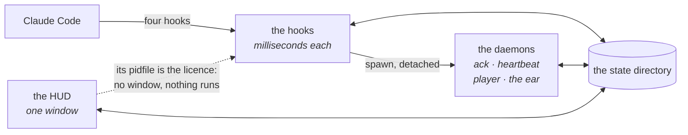

They coordinate through that one directory rather than through a bus, because the coordinating processes come and go faster than a connection could be established, and because the state has to survive all of them dying at once.

| | Lifetime | Started by |
|---|---|---|
| **The hooks** | milliseconds | Claude Code, one per event. They read the config fresh each time, which is why a config change needs no restart |
| **The HUD** | hours | you, or the first session. Its existence is what licenses everything else to run |
| **The daemons** | minutes to hours | something short-lived, detached. Each stops on its own when the window goes |

What each of them writes, and where, is in [Keys and files](reference/keys-and-files.md).

## A turn, end to end

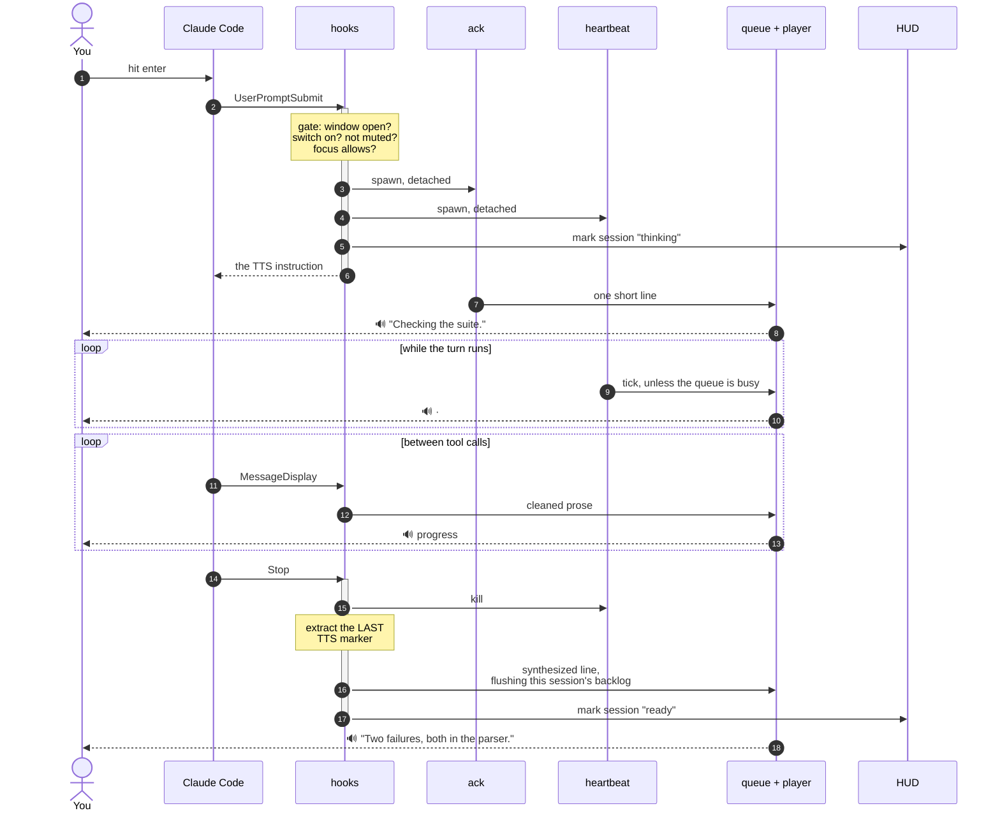

Two details in that sequence are the whole design.

**The gate in step 2.** Fail it and nothing is spawned, nothing is injected, and the turn costs exactly what it would have cost without this program installed:

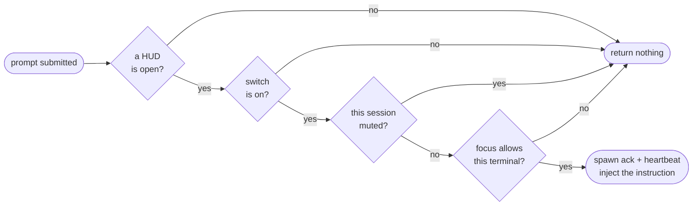

**The flush in the last step.** The final line drops the *same session's* pending items on its way into the queue, so the answer does not arrive behind three narration lines about how it was reached. Other sessions' audio is untouched.

## Text to speech

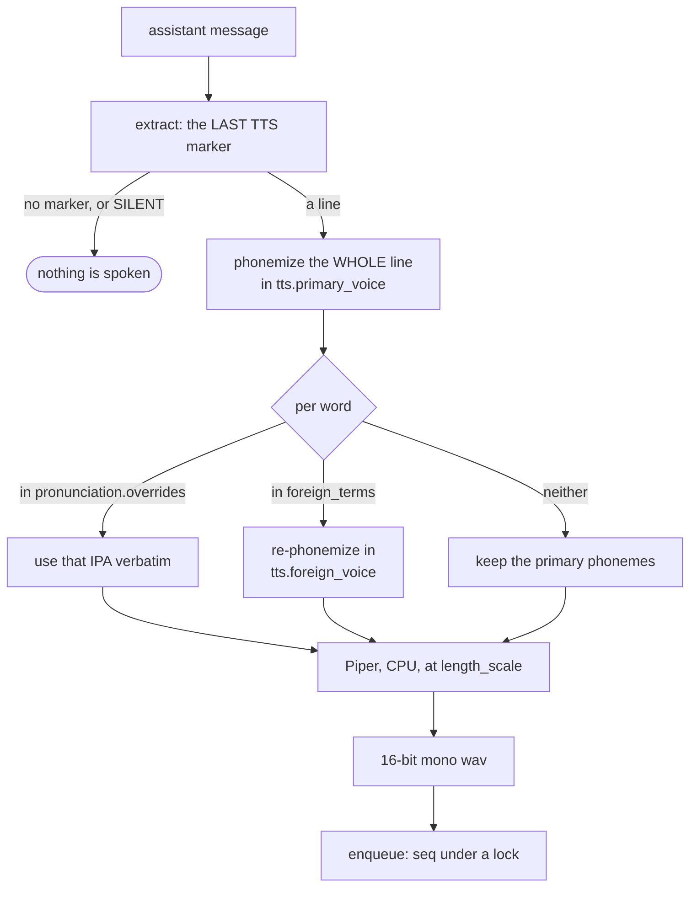

The whole line is phonemized first, and only then are individual words swapped, because that is what keeps the prosody and the word boundaries right — a per-word approach gets every term correct and the sentence wrong.

**Last, not first**, on the marker. A response that quotes the marker while explaining it — this page, for instance — would otherwise get its example spoken instead of its actual summary.

Then one player, holding one lock:

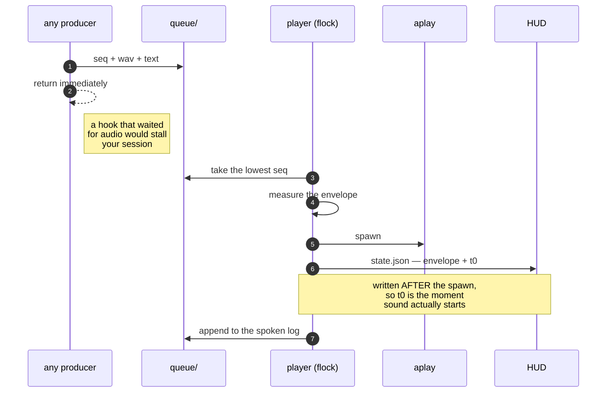

## How the reactor knows how loud

Two directions, two mechanisms, because only one of them is hard.

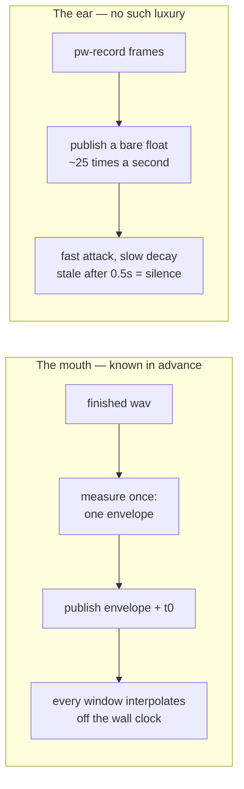

| | Mouth | Ear |
|---|---|---|
| Known in advance | yes — it is a finished file | no |
| Published as | one envelope + the start time | a bare float, ~25×/s |
| Read as | interpolated off the wall clock | the last value, stale after half a second |
| Can drift | no | not applicable |

A window opened mid-sentence catches up on the right syllable, because it computes the same function of the same clock every other window does. The ear cannot work that way, so it is smoothed instead — the way an ear behaves rather than the way a graph does.

Both are advisory. A window that cannot read either still animates, blind.

## The wrapper

There is no way into a session that is already running, so the text has to come from something that was present at launch.

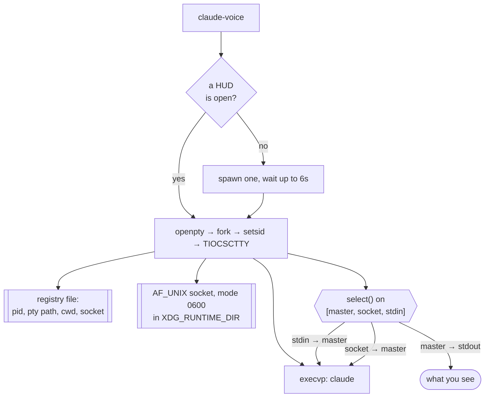

The delay before the carriage return is so the TUI has taken the text before the newline arrives.

The **pty path is the join key**: the wrapper knows the pty it started the session on, and Claude Code lists every live session under `~/.claude/sessions/`, so a wrapped session is matched to its conversation exactly, from the first moment — including for the dictated line that opens the conversation, which is precisely the one a title lookup could never match. That is also why the fork is hand-rolled rather than `pty.fork()`: it needs the slave's name.

### Dictation, end to end

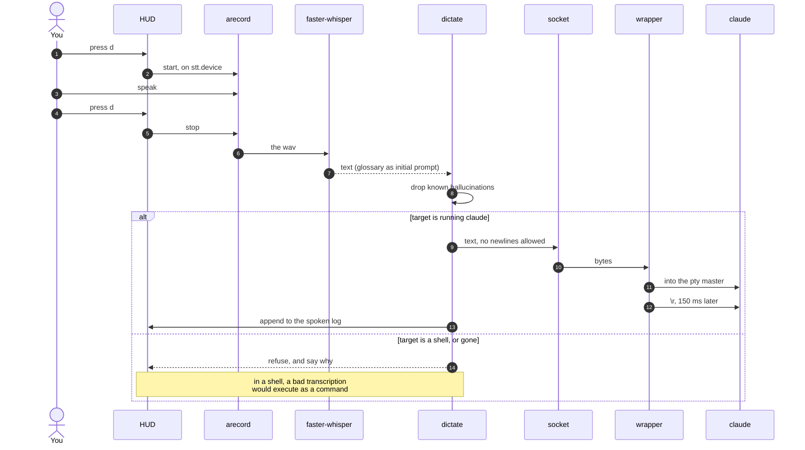

## Conversation mode

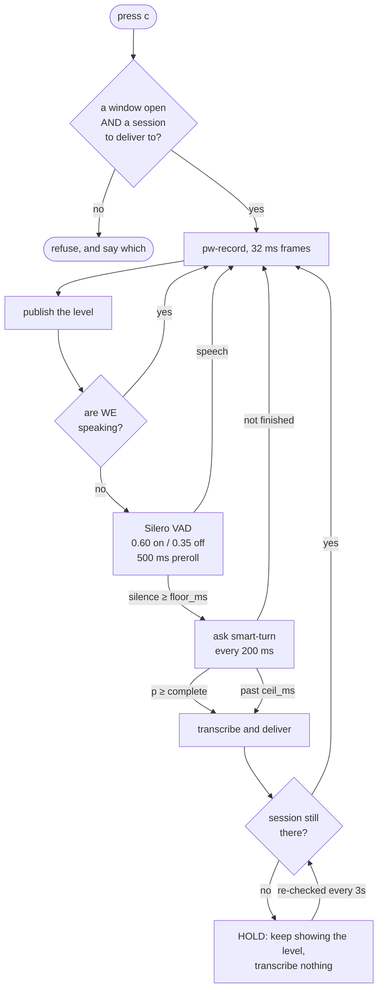

The hold is the part worth noticing. Voice activity is still detected and still drawn — so speaking into a dead setup looks different from speaking into a live one — but nothing is transcribed, because the result has nowhere to go. Open a session again and it resumes from the next sentence, with no key pressed.

Every three seconds it re-checks, which is what makes that work.

### Why three layers and not a timeout

A fixed silence threshold forces a choice between cutting people off and being slow.

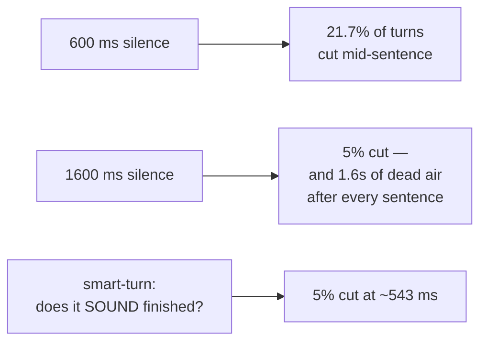

Figures from LiveKit's open turn-taking benchmark. Silero runs in about 0.07 ms per frame and smart-turn in about 25 ms, both on the CPU, so the cost of asking is not what makes the decision.

## The HUD, in two surfaces

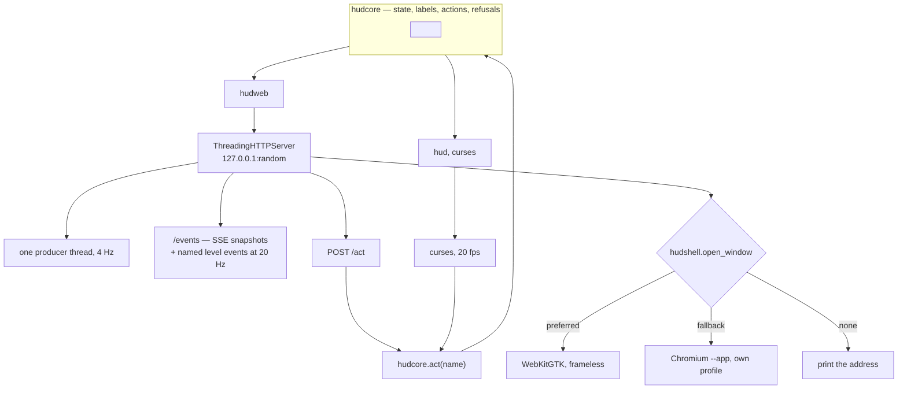

Both surfaces call one function for every key. There is one implementation of "turn the voice off", and one implementation of the reason it might refuse — so the two can disagree about how a thing is drawn, and cannot disagree about whether the microphone is open.

**The connection is the window.** The page holds the event stream open; when the last stream drops for more than a few seconds, the server exits, and on the way out — if it was the last window — it stops conversation mode, silences the queue and sweeps orphaned captures.

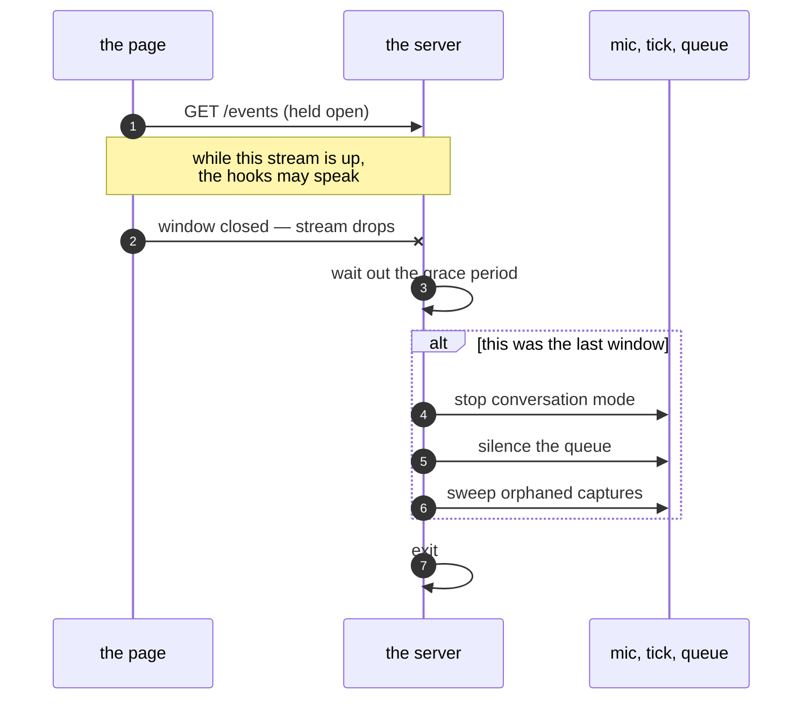

## Presence, focus and sessions

Four questions, four separate files, deliberately not one:

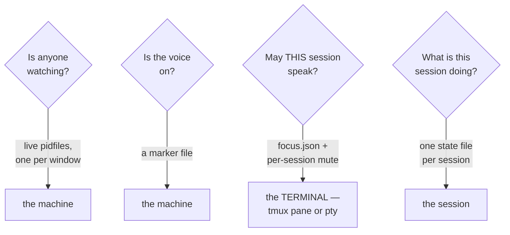

The grain in the third row is the one that took a rewrite to get right. Focus is filed under the terminal rather than the session id, so closing a conversation and starting another one in the same window keeps the voice where you put it — a session id would fall off on the restart, which is the exact moment every other window starts talking again.

## What leaves the machine

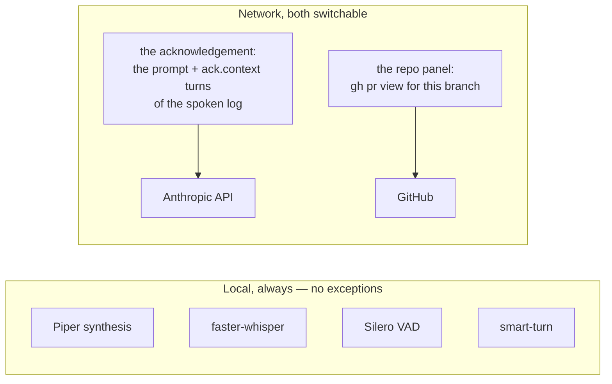

**No audio leaves the machine, ever.** There is no code path that sends a recording anywhere. `ack.contextual = false` removes the first call; `plugins.github.network = false` removes the second. [Security](security.md) has the detail.

## Models

| | | Where from |
|---|---|---|
| TTS | Piper | `~/.local/share/piper-voices/`, fetched from Hugging Face |
| STT | faster-whisper, `small` by default | its own cache |
| VAD | Silero v6 | read out of faster-whisper's assets — no torch |
| Turn-taking | smart-turn v3 | one ONNX file from Hugging Face, with features computed by faster-whisper's own extractor to avoid a `transformers` dependency |
