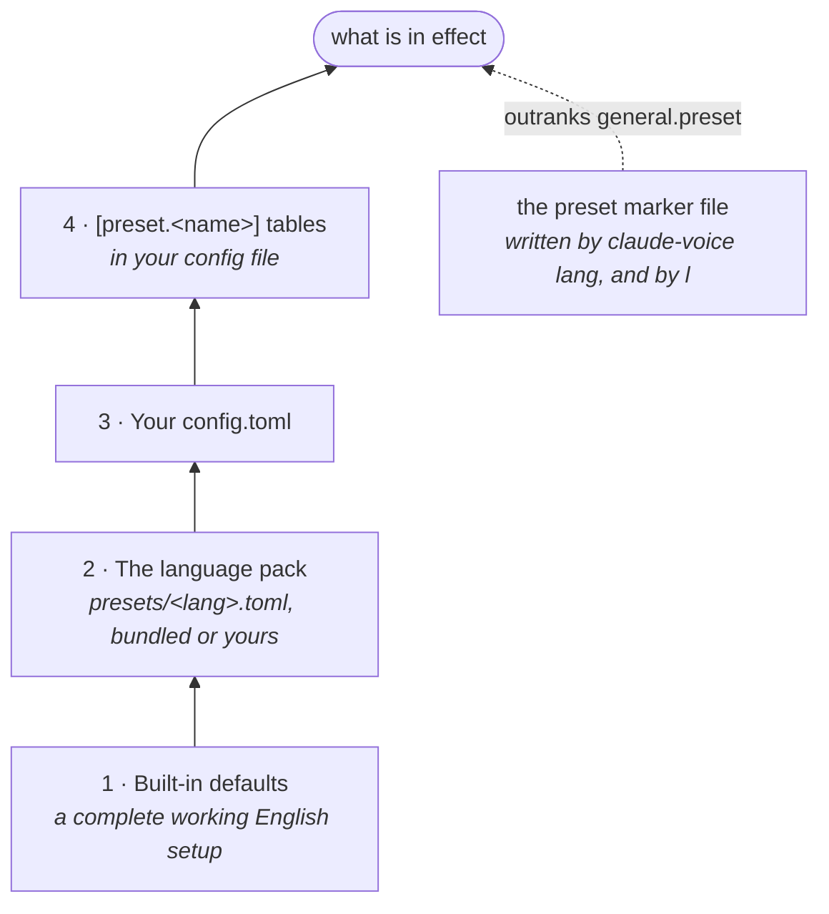
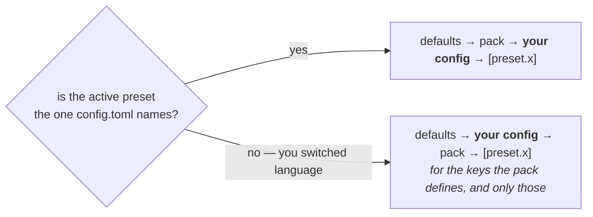

# Configuring claude-voice

How the configuration is found, how a value is resolved, what is deliberately kept out of it, and when a change takes effect.

Every individual key is in [Settings](reference/settings.md). This page is the machinery around them.

## Config file discovery

One file, always at the same place:

```
~/.config/claude-voice/config.toml
```

There is no search up the directory tree and no per-project config. The voice belongs to the person and the machine, not to a repository — two projects open in two terminals share one voice, one language and one microphone, because there is only one pair of speakers in the room.

The installer writes a starter file. If one already exists it is left alone, every time, however often you re-run the installer.

### Moving the directory

`CLAUDE_VOICE_HOME` moves the whole of it — config, presets, state, logs, the spoken history and the acknowledgement cache — not just the config file:

```bash
CLAUDE_VOICE_HOME=~/.config/claude-voice-work claude-voice hud
```

Every path in the program hangs off that one value, which is what lets several profiles coexist on one machine, and is also how the test suite runs without touching your real setup.

### Why TOML

The interesting values here are prose: the spoken instruction, the acknowledgement phrases, a dictation glossary. Multi-line strings in JSON are a wall of `\n`. Python 3.11 reads TOML from the standard library, so it costs no dependency.

## A config that does something

The starter file is nearly empty on purpose. Here is one with the keys people actually change:

```toml
[general]
preset = "en"
name = "Jarvis"                   # the HUD banner

[tts]
provider = "piper"                # piper | chatterbox
length_scale = 1.06               # >1 is slower — butler pacing lives here

[narrate]
word_limit = 50                   # spoken whole below this, trimmed above
max_per_turn = 12

[stt]
device = "plughw:CARD=Headset,DEV=0"   # arecord -L; prefer a NAME over an index
node = "alsa_input.usb-..."            # pw-record --list-targets

[ack]
context = 6                       # turns of spoken history the acknowledgement sees
timeout = 3.0                     # past this, the cached phrase plays instead

[hud]
required = true                   # no window open, nothing of ours runs at all
shell = "auto"                    # auto | webview | browser | none
github = true                     # the repo panel may ask gh about its pull request

[hud.panels]                      # which blocks the window draws; all on by default
system = true
repo = true
session = true
agents = true

[history]
enabled = true                    # the spoken log behind the HUD's h panel
position = "left"                 # left, right or bottom of the HUD window
cap = 400                         # lines kept per session; older ones trimmed
keep_days = 7                     # a session silent this long is swept away
```

## How a value is resolved

### The four layers

Values fall back **key by key**, so setting one thing does not wipe out the rest.



<div class="annotate" markdown>

1. **Built-in defaults** — a complete working English setup, no config file needed. (1)
2. **The language pack** for the active preset — `presets/<lang>.toml`, bundled or yours.
3. **Your `config.toml`**.
4. **`[preset.<name>]` tables** in your config file — per-language overrides.

</div>

1.  This is why deleting `config.toml` entirely leaves you with a working program rather than a broken one.

And above all four sits `~/.config/claude-voice/preset`, a one-line marker file holding the active language's name, which outranks `general.preset`. That is what [`claude-voice lang`](languages.md) and ++l++ in the HUD write.

### The inversion

There is one exception, and it is the reason a language switch used to look broken while everything else worked.

**While the active preset is not the one your config file names, layers 2 and 3 swap.** The language pack outranks your config file, for the keys the pack defines and only those.



A config file written for Spanish carries Spanish in it — the voice model, the instruction, the acknowledgement phrases. Left on top it would keep speaking Spanish inside the English preset. Your microphone device and your panel position are in no preset, so they never move.

### Per-language overrides

To pin a personal value to one language, use layer 4, which is always on top:

```toml
[preset.en.tts]
voice_model = "~/.local/share/piper-voices/en_US-lessac-high.onnx"

[preset.es.tts]
voice_model = "~/.local/share/piper-voices/es_MX-claude-high.onnx"
```

Any table can be nested under `[preset.<name>]`, not only `[tts]`.

!!! tip "The rule of thumb"

    If a value would be *wrong* in another language — a voice model, the instruction, the acknowledgement phrases — it belongs under `[preset.<name>]`. If it is a fact about your hardware or your taste in layout, the top level is right and it will survive every switch.

### Seeing what won

```bash
claude-voice config
```

Prints the resolved configuration **and the provenance of the preset** — whether it came from the switch, from `general.preset`, or from the default. Between that and `claude-voice doctor`, which names the voice model actually loaded, there is no configuration question that needs guessing at.

## What is deliberately not in the config file

### Marker files

Three pieces of state live beside the config as one-line files rather than inside it:

| File | What it holds | Written by |
|---|---|---|
| `enabled` | the on/off switch | `claude-voice on` / `off`, ++m++ |
| `preset` | the active language | `claude-voice lang`, ++l++ |
| `hud-history` | whether the history panel is showing | ++h++ |

They are files because **a tool that rewrites TOML you wrote by hand eventually eats a comment it did not write.** Everything a keystroke can change is kept out of the file a person edits.

Delete any of them and the corresponding config value is back in charge.

### Tune files

`claude-voice narrate --tune` and `claude-voice build-ticks` write small JSON files for the same reason — they are experiments, and an experiment should not edit your config.

### State

The rest of the directory is state, not settings: session files, pidfiles, the spoken logs, the acknowledgement cache, the tick sounds, the cloned voice. [Keys and files](reference/keys-and-files.md) has the inventory.

## When a change takes effect

| | |
|---|---|
| The hooks — instruction, tags, acknowledgement, heartbeat, narration, the spoken line | **immediately**, on your next prompt. They are short-lived processes that read the config per invocation |
| The HUD's labels and language | reloaded in place |
| `[hud.panels]`, `hud.shell`, window size | when the HUD is next opened |
| Conversation mode's language | when it is next started — the HUD restarts it for you on a language switch |
| `[ack].phrases`, or a new voice model | after `claude-voice build-acks`, which re-synthesizes the cache |
| `[thinking].style` | after `claude-voice build-ticks` |
| `tts.provider = "chatterbox"` on a machine that has never used it | after `claude-voice voice --fetch` and `--build` |

**Nothing here needs Claude Code restarted.** That is a consequence of the hooks being processes rather than a resident plugin.

## Editing a language pack

Everything above is about your own config. The other half of the configuration is the [language pack](languages.md), which carries the values that are facts about a language rather than about you: the voice, the instruction, the acknowledgement phrases, the dictation glossary, the pronunciation tables and the HUD's labels.

Copy a bundled pack into `~/.config/claude-voice/presets/` and edit it. **A user pack shadows a bundled one of the same name**, so the way to adjust `es` slightly is to copy it there, keep the name, and change what you want. Nothing inside the install needs patching, and an upgrade cannot overwrite what you wrote.

## If a change appears to do nothing

In roughly the order things go wrong:

1. **`claude-voice config`** — is the value in effect, and which layer supplied it?
2. **Is it pinned to the wrong language?** A `voice_model` or an `instruction.text` at the top level is outranked by the pack after a switch. Move it under `[preset.<name>]`.
3. **Does it need a rebuild?** Phrases and tick styles are synthesized once. See the table above.
4. **Is it a marker file, not a config key?** The switch, the language and the history panel are files. Deleting the marker returns control to the config.
5. **`claude-voice doctor`** — it names the voice model actually loaded, the provider in effect, and every hook.
