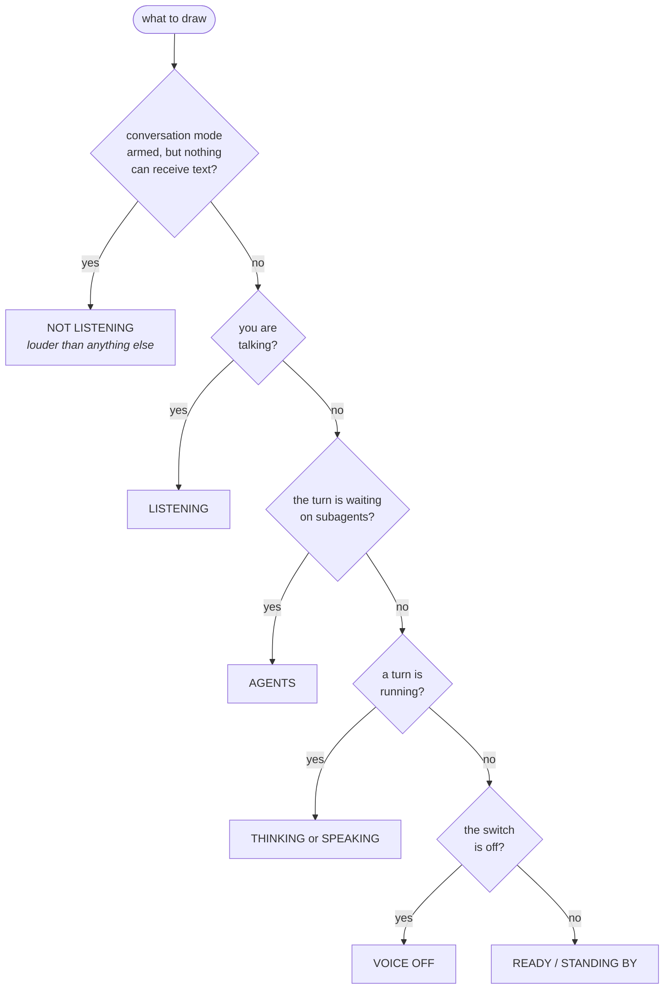

# The HUD

A frameless window that shows the state at a glance, and answers the questions you would otherwise ask by squinting at a terminal: is it listening, is it about to speak, is anything actually running.

```bash
claude-voice hud                # the status window
claude-voice hud --terminal     # the same HUD on a character grid
claude-voice hud --url          # print the address, open nothing
claude-voice hud --shell browser
```

It opens with your first `claude-voice` session, so most of the time you never type this. Worth an alias for the times you do:

```bash
echo "alias hud='claude-voice hud'" >> ~/.bashrc
```

## The HUD is the application

This is the design decision the rest of the window follows from.

| | Who starts it | Where it lives |
|---|---|---|
| **The voice** (speaking, narration, tick) | Claude Code, via the hooks | inside your session — but only while a HUD is open |
| **The HUD** | you, or the first session you start | a long-lived process of its own |

While a window is open the hooks speak. While none is, **nothing of ours runs at all** — nothing spoken, no acknowledgement, no heartbeat, no microphone held open, and no instruction added to your prompts. A machine with no window open is not spending tokens on lines nobody will hear.

Closing the window closes the rest of it: conversation mode is stopped, the microphone is released, anything queued or playing is cut. And because the exit that matters most is the one nobody gets to clean up after — a killed terminal, a machine losing power — the microphone daemon and the heartbeat also check for themselves, on the timer they already run on, and stop within seconds of the last window going away.

Closing does not turn the voice **off**, it suspends it. Open a HUD again and it picks up where the switch left it, with no keys pressed.

```toml
[hud]
required = true    # false gives the older behaviour: hooks alone, HUD as a viewer
autostart = true   # `claude-voice run` opens one if none is up
```

`required = false` is right for a machine you never sit in front of and wrong for a laptop with a microphone in it.

**One HUD, however many sessions.** Run `claude-voice` in a second terminal and it attaches to the first one's window.

## The reactor

The reactor carries the state, and only the state. The instrument panel around it never changes colour, because a window whose chrome dims when nothing is happening reads as a window that is broken.

| Label | |
|---|---|
| `STANDING BY` | nothing running |
| `THINKING` | a turn is in progress |
| `AGENTS` | the turn is waiting on subagents |
| `SPEAKING` | amber, moving with the audio |
| `LISTENING` | a dashed ring: conversation mode is armed |
| `VOICE OFF` | the switch is off |

The precedence between them is deliberate, and it reads as one sentence: you talking wins over anything Claude is doing; except when nothing is on the other end, which is louder still; agents out replaces `THINKING` with who is doing the thinking; and the voice being off replaces a calm state, but never a live one.



The last branch is the one that stops the window lying: the voice being off never overwrites a state that is actually happening, because a session that is working while the switch is off is still working.

### How it follows the voice

The two directions are not the same problem, and only one of them is hard.

**Speaking.** A line being spoken is a finished file before a sample of it is played, so its shape is known in advance: the player measures it once, publishes the envelope with the moment playback started, and every window draws it off the clock. Nothing is streamed and nothing can drift — a window opened mid-sentence catches up on the right syllable. It swells on a vowel, spikes on a stressed syllable and falls into the gaps between words, so a two-word answer and a long one no longer look the same.

**Listening.** The microphone has no such luxury, so its level is published as it is heard, about twenty-five times a second, and the reactor rises fast and falls slowly the way an ear does rather than the way a graph does.

Both are advisory. A window that cannot read either still animates; it just animates blind.

### Agents

Waiting on subagents looks the same as thinking from the inside, but it is not the same thing — if agents are out, the wait has an owner. Each one gets a small reactor of its own, in orbit around the main one, so the count is something you read rather than something you tally; the panel beside it names what each is doing.

## The panels

Two of them the window draws itself; the readouts are [plugins](plugins.md), switched in the one table that switches every plugin.

```toml
[hud.panels]     # the blocks the window draws itself
session = true   # where dictation goes, language, microphone
agents = true    # the list of running subagents

[plugins.enabled]
system = true    # cpu, memory, disk, gpu
github = true    # repository, branch, pull request, checks
```

Everything is on out of the box, because a HUD that hides half of itself until you find a config file looks broken. But not everybody works in pull requests, and a panel listing subagents is noise to somebody who has never launched one.

Off is genuinely off, not hidden: with `github = false` the branch is not read and `gh` is never called. The one thing a panel switch does not touch is the reactor, which shows the state of the work rather than a block of the window — waiting on subagents still colours it, and still says so, with the list switched off.

The terminal HUD draws what it can of the same set: a plugin declares which of the two windows it belongs in, and one that says browser only is not asked for a terminal frame at all. Changes take effect when the HUD is next opened.

### The repo panel

It names what the watched session is working on: the repository, the branch, the pull request that branch has open, and the state of its checks — how many passing, how many running, and the names of the ones that failed.

It is there for the ten minutes after a push, when the only question in the room is whether the thing went green and the answer otherwise costs another window.

The branch is read off disk and is always current. The rest comes from `gh` on a slow clock — about once a minute, every twelve seconds while something is still running — asked in a background thread, so a slow network can make that row late but can never make the window stutter. No repository, no `gh`, no pull request: the rows that have no answer are not drawn.

```toml
[plugins.github]
network = false  # keep the repository and branch; ask gh nothing
```

`plugins.github.network` is a narrower switch than `plugins.enabled.github`, and it is the only thing in this program besides the acknowledgement that talks to a network. Use `network = false` to keep the branch and drop the network; use `plugins.enabled.github = false` to drop the block entirely.

The repo panel draws in both windows. In the terminal it is the row above the title, the whole panel on one line.

### The system panel

CPU, memory, disk, and the graphics card's load and VRAM, named by its actual board, with the absolutes behind the percentages in tiles underneath. NVIDIA is read through `nvidia-smi`; AMD is read from sysfs. A machine with neither simply does not draw the row.

It draws in the browser window only. Five meters and four tiles need a rail, and the terminal has the one row above its title — which the branch has a better claim on.

## The keys

| Key | |
|---|---|
| ++m++ / ++space++ | voice off / on, for the whole machine — off silences whatever is playing, instantly |
| ++f++ | mute every session except the one ++t++ points at, and unmute them again |
| ++l++ | language: switch to the next preset, labelled in the language it gives you |
| ++d++ | dictate: record, transcribe, send |
| ++c++ | conversation mode: continuous listening |
| ++t++ | switch which session receives dictation — the voice follows it |
| ++h++ | history: show or hide the spoken log beside the reactor |
| ++x++ | close an orphaned microphone capture (emergency) |
| ++q++ | quit — and the last window closing stops the voice, the microphone and the heartbeat with it |

Every key routes through one shared implementation, so pressing ++m++ in the terminal and clicking the same button in the window run the same function — including every refusal, so the two surfaces cannot disagree about why something did not happen.

## The window itself

Not a browser tab. The page opens in one of these, in order:

| shell | | what it is |
|---|:---:|---|
| `browser` | :material-star: | Chrome or Chromium in `--app` mode with a profile of its own, so it is a window and not a tab in the browser you are using |
| `webview` | :material-check-bold: | WebKitGTK through the system PyGObject — frameless, stays above other windows, paints in a quarter of a second |
| `none` | :material-minus: | print the address and open nothing — for a second screen, or a machine with no desktop |

`auto` tries them in that order. Pin one with `hud.shell` in the config, or for one run with `claude-voice hud --shell webview`.

!!! info "Why the browser is first, when the frameless window is the nicer object"

    Because we take WebKit's GPU renderer away. `WEBKIT_DISABLE_DMABUF_RENDERER=1` stops it painting a blank white window on NVIDIA, and the price is that it rasterizes the reactor on the CPU: **97% of a core, against 14% for Chromium**, which composites on the GPU and needs no such workaround.

    The HUD is on screen all day by design, so its idle cost is the one cost you pay continuously — on a laptop it is a battery question as much as a speed one. A title bar is not worth seven times the CPU. [Performance](performance.md#the-window-browser-against-webview) has the measurements.

    `webview` is one word away if you want the frameless window and have the headroom, and stays the fallback on a machine with no Chromium at all.

A frameless window has no title bar and no resize grips, so the page lends it both: drag the HUD's own bar to move the window, drag any edge or corner to resize, double-click the bar to maximise, and the `✕` at its right closes the HUD — as do ++q++ and ++escape++.

Where you put it and how big you made it are written down when it closes and used again next time, so it only opens in the middle of the screen once.

The layout is sized in `em` off one number that follows the window, so a bigger window is a bigger HUD rather than the same HUD with more background around it. Three columns hold down to the smallest window the shell will make — 720×520, adjustable with `hud.min_width` and `hud.min_height` — and stack into one column below that, which only a browser can reach.

The webview needs two distro packages and nothing from PyPI. Without them it falls back to the browser window on its own, which needs nothing at all. Either way the install stays at its published dependencies: the server is the standard library, the page is three files off disk, and there is no CDN, no bundler and no node.

??? info "Two environment settings the launcher applies, and why"

    Both are the difference between a window and a bug report.

    `GDK_BACKEND=x11` — GNOME's Wayland compositor refuses "keep above" to every toolkit there is, and under XWayland it works.

    `WEBKIT_DISABLE_DMABUF_RENDERER=1` — WebKitGTK's newer renderer paints a blank white window on NVIDIA and on several compositors.

### The window is the connection

The page holds an event stream open, and that stream is what counts as an open window. While it is up the hooks speak; when you close the window the server notices the stream drop, shuts itself down, and takes the microphone, the heartbeat and any queued audio with it — exactly what closing the terminal HUD does.

The page it serves is locked down, because the buttons open a microphone and redirect the voice. [Security](security.md) has the specifics.

## The terminal HUD

```bash
claude-voice hud --terminal
```

A second surface, drawn out of ring glyphs on a character grid:

```text
                          C L A U D E
                             VOICE ON
  m: turn OFF and silence · d: dictate · c: conversation · h: hide history · q: quit
                          │
       H I S T O R Y      │
  ↑↓ scroll  ·  g/G: ends │              ·  ·  ·
                          │         ○              ○
 14:02  you › run the     │      ○     T H I N K I N G    ○
             tests again  │         ○              ○
 14:02 said ‹ Checking    │              ·  ·  ·
             the suite.   │
 14:04 said ‹ Two         │        ▁▂▃▅▆▇█▇▆▅▃▂▁▂▃▅▆▇█
             failures.    │
 14:05  you › fix them    │
```

It is the right one for a machine with no desktop, an ssh session, or a spare pane you already have open, and a straight downgrade anywhere else — a character grid cannot draw a curve.

Same HUD either way. The reactor, the history, the system meters, the keys and every refusal come from one module that both windows read, so there is one answer to "is the microphone open", not two.

## Running it without the CLI

The CLI is a thin dispatcher; nothing requires it. Every module is also a script, and runs directly under an interpreter that has `piper-tts` in it — which the installed tool's own interpreter does:

```bash
uv tool run --from claude-voice python -m claude_voice.hudweb
```

From a clone, which is the shorter path when you are changing something:

```bash
uv run python claude_voice/hudweb.py
```

The subcommands are the same dispatch table either way.

!!! warning "Do not freeze an alias on a path into a checkout"

    An alias like `python /some/path/hud.py` keeps running that copy after the checkout moves or updates, and what you get is a `NameError` or an `AttributeError` from a stale file. `claude-voice hud` resolves the interpreter and the module locations for you.
