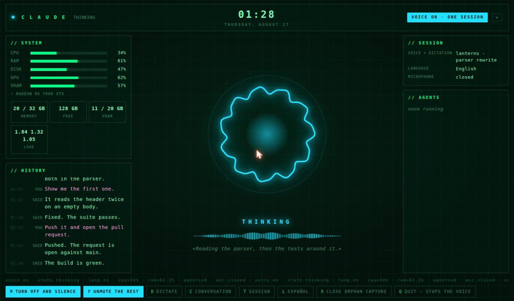
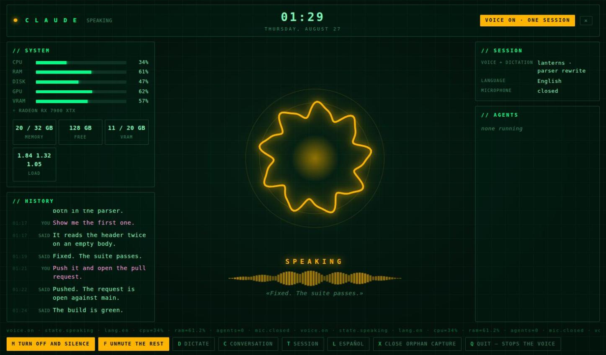
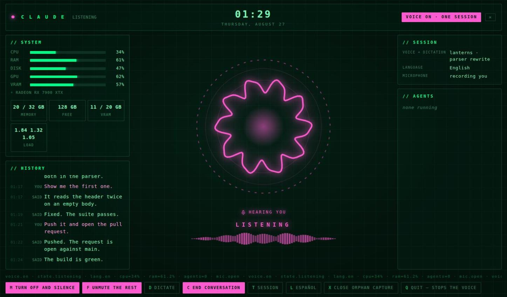
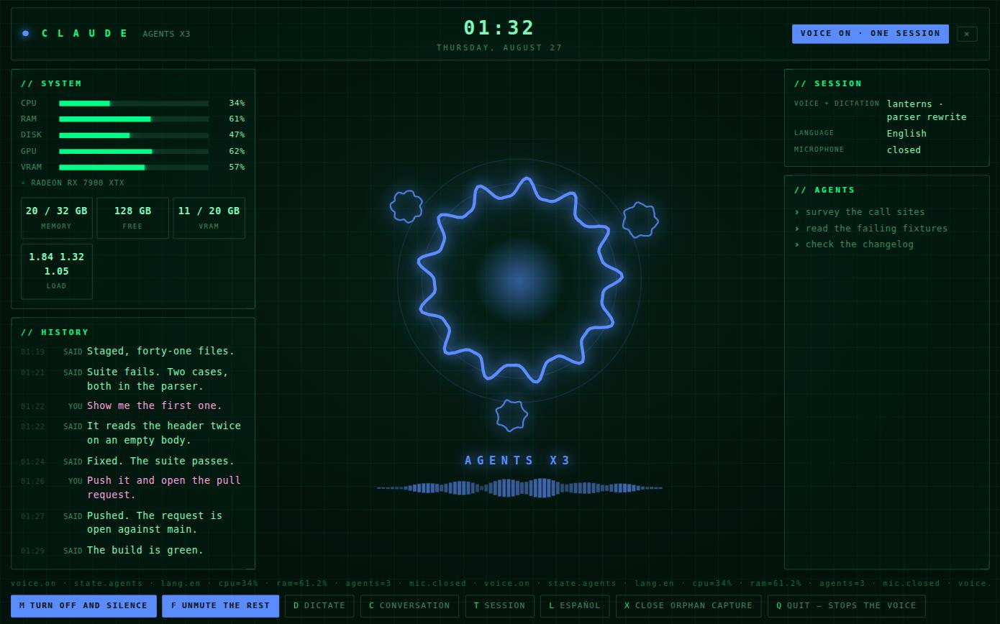

# claude-voice

Give Claude Code a voice, an ear and a status display — locally, with no cloud speech services.

`claude-voice` hooks into Claude Code and turns a silent terminal into something you can work alongside: it says what happened at the end of a turn, narrates the long middle, listens when you talk back, and puts all of it in one window you can glance at instead of squinting at scrollback.



Everything runs on your machine. No audio leaves it.

## What it does

<div class="grid cards" markdown>

-   :material-volume-high: **Speaks the summary, not the response**

    A hook asks the model to end each turn with one sentence written *for the ear*. That sentence is what gets spoken — never the markdown, the diffs or the file paths. [The voice](voice.md)

-   :material-radio-tower: **Narrates the long middle**

    A five-minute task is not five minutes of silence: progress is spoken between tool calls, and a soft tick keeps running underneath — with a different tick when subagents are the ones working. [The voice](voice.md)

-   :material-microphone: **Listens**

    Push-to-talk dictation, or continuous conversation mode with real end-of-turn detection, delivered straight into your running Claude session. [The ear](ear.md)

-   :material-monitor-dashboard: **Shows you the state**

    A frameless window with a reactor that follows the actual audio, system meters, the branch and its pull request, the running subagents, and the log of everything said out loud. [The HUD](hud.md)

</div>

## Quickstart

Linux only for now — see [Platform support](platforms.md). Three commands.

=== "Debian / Ubuntu"

    ```bash
    # 1. system packages — yours to install; nothing here runs sudo for you
    sudo apt install alsa-utils pipewire-bin python3-gi gir1.2-webkit2-4.1

    # 2. everything else: the program, a voice, the config, the hooks
    curl -fsSL https://raw.githubusercontent.com/jcarranz97/claude-voice/main/install.sh | bash

    # 3. turn the voice on — off is the default, always
    claude-voice on
    ```

=== "Fedora"

    ```bash
    sudo dnf install alsa-utils pipewire-utils python3-gobject webkit2gtk4.1
    curl -fsSL https://raw.githubusercontent.com/jcarranz97/claude-voice/main/install.sh | bash
    claude-voice on
    ```

=== "Arch"

    ```bash
    sudo pacman -S alsa-utils pipewire python-gobject webkit2gtk-4.1
    curl -fsSL https://raw.githubusercontent.com/jcarranz97/claude-voice/main/install.sh | bash
    claude-voice on
    ```

Then start your session with `claude-voice` instead of `claude`:

```bash
claude-voice                 # opens the HUD, and gives the ear somewhere to type
claude-voice --model opus    # arguments go straight through to claude
```

That is all of it. No clone, no tmux, no configuration to write first, and nothing to paste into `~/.claude/settings.json` — the script merges the four hooks in and keeps whatever was already there.

Two things it deliberately does not do: install system packages, which is step 1 and stays yours to run, and turn the voice on, which is step 3 and stays a thing you ask for.

!!! tip "When something is wrong"

    `claude-voice doctor` says what. It checks the voice model, the audio session, and every hook, and prints the command that fixes each thing it found.

## Where to go next

| If you want | Go to |
|---|---|
| to be walked through it, start to finish | [Tutorials](tutorials/index.md) |
| what each install step actually does | [Installation](installation.md) |
| the commands you will use daily | [CLI reference](reference/cli.md) |
| the window, dictation, conversation mode | [The HUD](hud.md), [The ear](ear.md) |
| to change the voice, language or panels | [Configuration](configuration.md) |
| it installed but says nothing | [Troubleshooting](troubleshooting.md) |
| why any of it is built this way | [Design decisions](design.md) |
| to change the code | [Contributing](contributing.md) |

## What it looks like

The reactor carries the state, and only the state: the instrument panel around it never changes colour, because a window whose chrome dims when nothing is happening reads as a window that is broken.

**Speaking.** Amber, and the reactor moves to the voice itself — it swells on a vowel, spikes on a stressed syllable and falls into the gaps between words, so a two-word answer and a long one no longer look the same. The line it is saying is written underneath.



**Listening.** Conversation mode is armed — the dashed ring — and you are talking right now, with the reactor following how loudly. The microphone badge has its own colour, because the ear being open is not a state of Claude's, and confusing the two is how you end up talking to a window that stopped listening ten minutes ago.



**Armed and quiet.** The same ring, the badge reading `ready to listen`. This is the state that used to be invisible: microphone open, nothing arriving, indistinguishable from the mode being off.


**Agents.** Waiting on subagents looks the same as thinking from the inside, but it is not the same thing — if agents are out, the wait has an owner. Each one gets a small reactor of its own, in orbit around the main one, so the count is something you read rather than something you tally; the panel beside it names what each is doing.



There is a second surface for the same HUD, drawn out of ring glyphs in a terminal, for a machine with no desktop:

```text
                          C L A U D E
                          VOICE ON
  m: turn OFF and silence · d: dictate · c: conversation · l: Español · h: history · q: quit

                              ·  ·  ·
                        ○              ○
                    ◦     T H I N K I N G    ◦
                        ○              ○
                              ·  ·  ·
                     ▁▂▅▇▆▃▂▁▂▄▆▇▅▃▁▂▃▅▄▂▁

                        dictation → myrepo · fixing the parser
                   «Done, the tests pass.»
```

Both read the same module, so they cannot disagree about what is on screen — only about how it is drawn.

## Requirements at a glance

| | |
|---|---|
| :material-linux: OS | Linux with PipeWire (PulseAudio works for playback) |
| :material-robot: Runtime | Claude Code. Other agent runtimes are planned |
| :material-language-python: Python | none of your own — `uv` provisions 3.11+ |
| :material-account-voice: TTS | [Piper](https://github.com/OHF-Voice/piper1-gpl) — local, neural, CPU |
| :material-ear-hearing: STT | [faster-whisper](https://github.com/SYSTRAN/faster-whisper) — local, CPU |

The full list, and what is not supported yet, is in [Platform support](platforms.md).

## Licence

MIT. The source is on [GitHub](https://github.com/jcarranz97/claude-voice).
