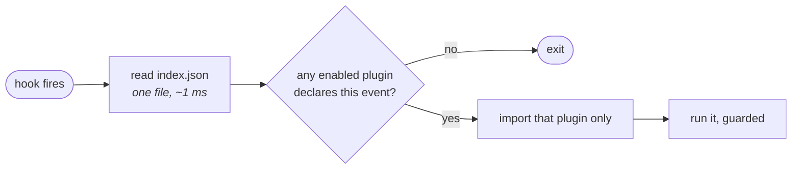
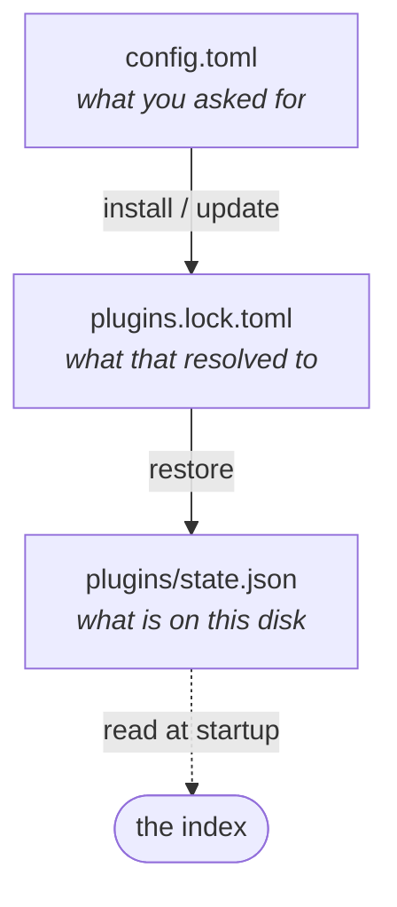
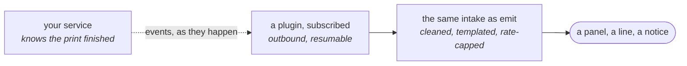

# Plugins

What a plugin is, how one is installed and switched off, and why the manifest says so much — for anyone extending claude-voice or wondering whether a feature belongs in the package at all.

## The package cannot keep absorbing features

Every capability so far lives in the wheel. That was right while the capabilities were the product — a voice, an ear, a HUD — and it stops being right the moment a feature is interesting to one person. A diff viewer that opens VS Code, a panel showing a 3D printer's bed temperature, a chime when CI goes red: none of those belong to everybody, and each one added to the package is another module in the flat namespace, another entry in `ROUTES`, another section in the settings reference, and another thing that has to keep working forever.

A plugin is the answer to "this is useful, but not to everyone". It lives in its own repository, it is installed by pasting a link, and it can be switched off in one word.

## Small things stay small

Most plugins are a table. Some are a table with a bar in it. A few are a live view of a machine in another room, and one or two will be something nobody has thought of yet.

A plugin system that only serves the last of those makes the first one cost a week. One that only serves the first makes the last one impossible. So the surface is a ladder, and the rule is that **you only pay for the rung you are on**:

| | | |
|---|---|---|
| 1 | rows | a title and label-value pairs. No HTML, no CSS, no rendering. Ten lines. |
| 2 | a line | one sentence spoken, or one notice shown, when something happens |
| 3 | a fragment | a window built from the HUD's own blocks, meters and cards |
| 4 | a fragment with its own assets | charts, a canvas, scoped CSS — shipped in the plugin, never fetched |
| 5 | a process | something that must keep running: a socket held open, a subscription, real work |
| 6 | another application | launch it and get out of the way — an editor, a slicer, a browser |

The ten-line plugin at rung one never imports a renderer, never opens a socket, never learns what a theme is. It returns a dict. Everything above it is opt-in, declared in the manifest, and invisible to a plugin that does not ask.

### Charts without a chart library

Rung four is usually reached for too early. A sparkline, a gauge or a bar is a handful of SVG, generated in Python where the numbers already are:

```python
def spark(points, w=120, h=24) -> str:
    """A line, in SVG, in eight lines of Python. No library, no script, no fetch."""
    lo, hi = min(points), max(points) or 1
    step = w / max(len(points) - 1, 1)
    pts = " ".join(
        f"{i * step:.1f},{h - (v - lo) / (hi - lo or 1) * h:.1f}"
        for i, v in enumerate(points)
    )
    return f'<svg width="{w}" height="{h}"><polyline points="{pts}" fill="none" stroke="var(--accent)"/></svg>'
```

It inherits the theme because the stroke is a token, it costs nothing to load, and it cannot break the page. Reach for a real charting library when you need axes, interaction and a legend — and then ship it inside the plugin.

### A plugin with its own process

Rung five is for the plugin that cannot be a function call: it holds a subscription open, watches a device, or does work that takes longer than a draw. It declares a daemon, and the host supervises it:

```toml
[provides]
daemon = true
panel = ["lab"]

[entrypoints]
daemon = "cv_lab.watch:run"
panel = "cv_lab.panel:panel"
```

```python
def run(ctx) -> None:
    """Started when a window opens, stopped when the last one closes."""
    while ctx.alive():               # false as soon as nothing is watching
        ctx.publish({"state": "printing", "progress": 41})
        ctx.sleep(10)                # interruptible; not time.sleep
```

The daemon never draws. It publishes state, and the panel reads it — which is what keeps the drawing path fast and keeps a wedged daemon from being able to freeze a window.

It is also subject to the rule the rest of the package already obeys: **nothing of ours runs while no window is open.** A plugin daemon is started when the HUD appears and stopped when the last one goes, so a machine with the HUD closed is a machine running nothing, however many plugins are installed. A plugin that wants to poll a printer all night is asking for something the application deliberately does not do.

## A plugin is a directory with a manifest

```
claude-voice-weather/
├── plugin.toml
└── cv_weather/
    ├── __init__.py
    └── panel.py
```

`plugin.toml` at the root is the whole contract. Only `[plugin] name` is required; a plugin that puts its code where the conventions expect it needs very little else.

```toml
[plugin]
name = "weather"                     # the namespace, and the directory name
version = "1.0.0"                    # optional — omitted, the commit is the version
description = "The weather where you are, in the corner of the HUD."
license = "MIT"

[requires]
claude-voice = ">=0.2"               # a floor, never a range
python = ">=3.11"
platform = ["linux"]                 # omit for any
windows = ["browser", "terminal"]    # which HUD surfaces it can draw in
needs = ["network"]                  # network | microphone | gpu | desktop
dependencies = []                    # PEP 508 strings, installed at the boundary

[provides]
panel = ["weather"]                  # a HUD panel
surfaces = ["panel", "voice"]        # where it CAN show up; the user picks which
# hook         = ["stop"]            # events it reacts to
# command      = ["weather"]         # subcommands it adds
# tts_provider = []                  # a voice
# theme        = []                  # a palette

[entrypoints]
panel = "cv_weather.panel:panel"     # imported only when the panel is drawn
# hook    = "cv_weather.panel:on_stop"
# command = "cv_weather.panel:main"

[options]
default_enabled = true               # false ships it off, for the user to opt in
```

The two tables that look redundant are not. `[provides]` is read on **every** invocation and answers "does anything care about this event"; `[entrypoints]` is touched only when the answer is yes. That split is the whole performance story, and the next section is why it had to exist.

## Nothing is imported to answer a question about a plugin

The constraint that shapes everything here: claude-voice has no daemon. A hook is a process that starts, does a few milliseconds of work and exits, four or more times per turn. There is nowhere to keep a loaded plugin between events.

Python's own plugin machinery assumes the opposite. Scanning installed distributions for entry points costs twenty to forty milliseconds, and importing a plugin costs whatever that plugin imports — a hundred milliseconds is ordinary, and one that reaches for a heavy dependency can cost half a second. Paid once by a long-running editor that is nothing; paid on every prompt by a hook that must not be noticed, it is the whole budget and then some.

So the manifest is read and nothing else. Every `plugin.toml` on the machine is merged into one small index, cached beside them and rebuilt only when a manifest's modification time moves:



A machine with twelve plugins installed and none of them listening for `stop` costs one file read on the Stop hook. This is the same idea as a code editor deciding from static JSON which extensions to wake, arrived at for a much harsher reason.

!!! warning "A manifest that lies is a plugin that never runs"
    If `[provides] hook` does not name the event, the entry point is never imported, however correct the code is. The index is the truth the hooks consult; the code is only consulted afterwards.

## Installed is not enabled

Three states, and keeping them apart is what makes a plugin safe to try:

| | |
|---|---|
| not installed | nothing on disk |
| installed | files on disk, manifest in the index, never imported |
| enabled | eligible to run when an event it declared fires |

Enablement is one table in the config file, and it is the only place the answer lives:

```toml
[plugins.enabled]
diff = true
lab = false                          # installed, dormant, nothing deleted
chatterbox = false                   # bundled, and off — same table, same rule
```

Disabling never removes anything and uninstalling is a separate verb. Every mature plugin system separates these two; the one that conflated them had to grow a second flag to un-conflate them.

## What ships is an example, yours wins

Some plugins are bundled — they live inside the wheel at `claude_voice/plugins/<name>/`, update with the application, and cannot be uninstalled. They can be disabled like anything else, which is what stops "bundled" from meaning "unremovable".

The rest are installed into the config directory. When both exist under one name, yours shadows the one that ships, exactly as a language pack in [`presets/`](languages.md) already does:

```
claude_voice/plugins/system/            # bundled — the example
~/.config/claude-voice/plugins/system/  # yours — the one that loads
```

`claude-voice plugin list` says when a name is shadowed. The install is then replaceable without taking your work with it, which is the rule the whole configuration already follows.

Bundled plugins live in the claude-voice repository, one directory each:

```
claude_voice/
├── plugins/
│   ├── system/
│   │   ├── plugin.toml
│   │   └── panel.py
│   └── github/
│       ├── plugin.toml
│       └── panel.py
└── hudcore.py
```

They sit **inside** the package rather than beside it because that is what ships in the wheel — a directory at the repository root would have to be listed in the build configuration and would still not be importable by name. The consequence is worth stating plainly: a bundled plugin is ordinary code in this repository, reviewed like the rest of it, held to the same coverage gate, and released on the same version. What makes it a plugin is not where it lives but that it goes through the same manifest, the same enable table and the same guard as a stranger's.

## A panel is data, not drawing

The HUD has two surfaces — a browser window and a curses one — and a plugin must not have to know that. Anything that draws itself twice will be drawn wrong once.

So a panel plugin contributes **rows**, not pixels:

```python
def panel(ctx) -> dict:
    """What to show, right now, without waiting for anything."""
    return {
        "title": "github",
        "rows": [
            {"label": "branch", "value": "main"},
            {"label": "pr", "value": "#38 open", "state": "ok"},
            {"label": "checks", "value": "running", "state": "busy"},
        ],
    }
```

Both surfaces already know how to draw a title and a list of label-value pairs; `state` picks the colour from the active theme and is the only styling a plugin gets. The function is called from the same snapshot every surface renders, which means it inherits the rule that snapshot already lives by: **it must return immediately**. A panel that wants a slow answer keeps its own cache and asks in a background thread, showing whatever the last answer was.

Panels are imported by the HUD, which is a long-lived process, so the import budget here is generous in a way the hooks' is not. A panel plugin may reasonably pull in a library. A `stop`-hook plugin may not.

## Where a plugin shows up is not the plugin's decision

A panel is one destination. It is not the only one, and it is the wrong one often — a print queue belongs in the corner of the HUD, a diff belongs in a window the size of a screen, a finished render belongs in a spoken sentence and nowhere else. Left to itself every plugin will pick the most attention-getting surface available, because that is how its author uses it.

So the manifest declares what a plugin **can** do and the configuration decides what it **does**:

```toml
# in the plugin's manifest — a claim about what it is able to render
[provides]
surfaces = ["panel", "window", "voice"]
```

```toml
# in your config — the decision
[plugins.lab]
surface = "panel"                    # panel | window | voice | notify | none
slot = "right"                       # which rail, when it is a panel
order = 20                           # lower is higher up
```

A plugin may hold several at once, and usually should: a panel that is always there, and a window behind it with the detail that does not fit.

```toml
[plugins.lab]
surface = ["panel", "window"]        # both, from one plugin
slot = "right"
```

The five destinations, and what each one costs you:

| | |
|---|---|
| `panel` | rows in the HUD, always visible, competing for space with everything else |
| `window` | a separate window, opened on demand — never on its own initiative |
| `voice` | a spoken line through the ordinary queue, subject to every existing gate |
| `notify` | one line in the HUD's notice area, transient, no permanent space |
| `none` | it runs and shows nothing, which is the right answer for a plugin that only has side effects |

Asking for a surface the plugin did not declare is a configuration error named at startup, not a silent nothing.

`slot` and `order` place a panel among the ones already there. The panels that ship take round numbers, so there is room between them:

```text
┌──────────────┬───────────────────────────┬──────────────┐
│ left         │                           │ right        │
│              │                           │              │
│ system   10  │          the HUD          │ session  10  │
│ weather  30  │                           │ github   20  │
│              │                           │ lab      40  │
└──────────────┴───────────────────────────┴──────────────┘
```

A panel with nothing to say returns no rows and takes no space, which is how a rail with four plugins in it stays readable.

### Not everything belongs in both windows

There are two HUD surfaces and they are not equally capable. A plugin says which it can draw in:

```toml
[requires]
windows = ["browser"]                # this one is not a terminal citizen
```

Half a dozen rows of numbers belong in both. A camera frame, a chart or a photograph does not — the terminal can carry a bar and a number, and cannot carry an image. Rather than shipping a sad version of itself, a plugin declares the truth and the host does the sensible thing: it is not offered in a window that cannot show it, and `plugin list` says which windows each plugin supports.

The rule this replaces was "both surfaces or neither", and the point of it survives: a plugin must not *silently* look like a different program in one window. Declaring the window it cannot serve is how it says so out loud.

### Pictures, and the files behind them

A panel row carries a label and a value. A window carries a fragment, and a fragment may contain an image — a camera frame, a plot, a photograph of the thing being described:

```python
def window(ctx) -> dict:
    return {"title": "bed", "html": f''}
```

Anything a plugin ships alongside its code — an image, an icon, a font, a stylesheet — lives in the plugin's own `assets/` directory and is served by the host under a path of its own. `ctx.asset()` returns that path. The rule is the one the browser surface already keeps: it comes from the plugin, never from the network.

Content fetched live is different and is allowed: a camera stream from your own service is an ordinary `src` and is exactly what the window surface is for.

### A row can be pressed

A panel row may carry an action, which the HUD binds to a key and a click:

```python
def panel(ctx) -> dict:
    return {"title": "lab", "rows": [
        {"label": "queue", "value": "3 jobs", "action": "window", "key": "l"},
    ]}


def act(ctx, name: str) -> tuple[bool, str]:
    """Never raises: a refusal is a message, not a dead window."""
    return (True, "opening") if name == "window" else (False, f"unknown: {name}")
```

This is the existing action registry, which already turns an exception into a refusal rather than a broken screen.

### The host owns the window

A plugin that wants a window does not open one. It hands the host a page and the host opens it through the same machinery the HUD itself uses — the webview if one is available, a browser in application mode otherwise, and nothing at all on a machine with no desktop. That is one implementation of window geometry, focus policy and the "no desktop session" case, rather than one per plugin, and it means a plugin cannot invent a window that ignores the rules.

Launching a *foreign* application is a different act and stays explicit: the diff plugin runs your editor, which is the entire point of it. The rules there are the plugin's to keep and the guard's to enforce — detached, never blocking the turn, never stealing focus while dictation is live.

!!! warning "Nothing opens a window by itself"
    A window is opened by something you did — a key in the HUD, a subcommand, an edit you made. A plugin that decides on its own that now is the moment for a window will be doing it while you are typing into something else. The panel and notice surfaces exist precisely so that a plugin with news has somewhere to put it that is not in front of your face.

### A plugin window is a claude-voice window

A window that looks like a different program is worse than no window. The whole appeal of a small dashboard appearing when you ask about a print is that it belongs to the thing already on your screen — same palette, same typeface, same furniture, same key to close it.

So the plugin returns a **fragment**, and the host serves the document around it: the stylesheet, the theme, the font stack, the title bar and the close key are not the plugin's to choose.

What a plugin builds from is the vocabulary the HUD's own panels are built from — a `block` with a heading, `meter` rows with a label and a bar and a value, a `card` for a line of prose, a `badge` for a state:

```python
def window(ctx) -> dict:
    p = ctx.http(URL, every=POLL[_state]).json
    return {
        "title": p["job"]["name"],
        "html": f"""
          <div class="block">
            <h2>printing</h2>
            <div class="meter">
              <label>progress</label>
              <div class="track"><i style="width:{p['progress']}%"></i></div>
              <b>{p['progress']}%</b>
            </div>
            <div class="meter"><label>nozzle</label><b>{p['nozzle_c']}C</b></div>
            <p class="card">{p['job']['eta_min']} minutes left</p>
          </div>
          
        """,
    }
```

Colour comes from the tokens rather than from literals — `--ink`, `--dim`, `--accent`, `--warn`, `--panel`, `--mono` — which is what makes a plugin follow a theme change it has never heard of. A plugin that writes `#00ff88` into its own CSS will be the one panel that stays green when everything else goes to a light palette.

The window is live for the same reason the HUD is: it subscribes to the host's event stream and re-renders when the plugin's poll produces something new. No reload, no second server, no timer in the page.

!!! note "No build step, no CDN, no network for the chrome"
    The browser surface has no bundler and fetches nothing from the internet to render itself, and a plugin does not get to change that. Whatever a window needs ships inside the plugin. A camera image or a stream from your own service is content and is fine; a font, a stylesheet or a script from somewhere else is not.

Values rendered from `rows` are escaped by the host. A plugin that returns raw `html` has taken that responsibility back — and a job name is whatever somebody typed into a slicer.

### Speaking is not a surface a plugin can seize

`voice` puts a line in the same queue as everything else, which means it passes every gate that already exists: the switch, the focus rule, the mute, and one line at a time in order. A plugin cannot speak while the voice is off, cannot speak over the assistant, and cannot jump the queue.

This is worth being blunt about because it is the one surface where a badly behaved plugin would be genuinely intolerable, and the protection is structural rather than a rule in a document: there is no path to the speaker that does not go through the queue.

### One plugin, two surfaces

The useful pattern is a quiet panel with a loud thing behind it: three rows in the corner, and a key that opens the full view in a window. A panel row may carry an action, the HUD binds it to a key, and the action is what opens the window.

That keeps the default cheap. The print lab is four rows until the moment you want the whole queue, and then it is a window, because you asked.

## The panels that ship are plugins too

The readouts in the HUD are not privileged. The system panel and the GitHub panel are bundled plugins, drawn through the same rows, switched off through the same table, and guarded the same way as anything you install:

```toml
[plugins.enabled]
system = true
github = false                       # no GitHub here, no panel, no `gh` call either
```

That is the point of building it this way rather than adding a hook here and there. A plugin API that only strangers use is one nobody tests; when the panels that ship go through it, a shape that cannot express a real panel is found immediately, by us, rather than eventually, by somebody else.

It also sets the standard for what a panel has to be able to say. The GitHub panel is not a decorative case: the branch is a file read that must stay current within seconds, the pull request is a network call that can hang, and the state it reports has four distinct values. Any panel shape that carries that carries a print queue too.

!!! note "The old panel keys keep working"
    A panel that becomes a plugin does not lose the setting that used to control it. `hud.github = false` continues to mean what it meant — read as an override of `plugins.enabled.github`, warned about once, and dropped a release later. A configuration that worked yesterday works today.

## Writing one

The smallest useful plugin is a panel over something the machine already knows. Two files.

```
claude-voice-weather/
├── plugin.toml
└── cv_weather/
    ├── __init__.py
    └── panel.py
```

Start with a source that cannot be slow, so that the only thing being learned is the shape:

```python
# cv_weather/panel.py
import shutil


def panel(ctx) -> dict:
    """What to show, right now."""
    free = shutil.disk_usage("/").free // 2**30
    return {"title": "disk", "rows": [{"label": "free", "value": f"{free} GB"}]}
```

with a manifest naming it:

```toml
[plugin]
name = "weather"
description = "The weather where you are, in the corner of the HUD."

[provides]
panel = ["weather"]
surfaces = ["panel"]

[entrypoints]
panel = "cv_weather.panel:panel"
```

Install it from the working copy and it is live:

```bash
claude-voice plugin install ./claude-voice-weather
```

That is a complete plugin. It declares one thing, it contributes one thing, and the host never imports it unless the panel is being drawn.

### Then make the source honest

Real data is behind a network call, and this is where a panel is usually got wrong. `panel()` is called on the draw path. It cannot wait for anything — not for a good connection, not for a bad one.

The discipline is the same one the repository panel already keeps: answer from a cache, refresh in the background, and show what you last knew while you find out again.

```python
# cv_weather/panel.py
"""The weather, in three rows. A panel plugin, entire."""

import json
import threading
import time
import urllib.request

URL = "https://wttr.in/?format=j1"
TTL = 900.0                          # the weather does not move faster than this
TIMEOUT = 5.0                        # it is a network call, and networks hang

_lock = threading.Lock()
_state = {"t": 0.0, "rows": [], "busy": False}


def _fetch() -> None:
    """Ask, off the drawing path. Never raises: the panel keeps the last answer."""
    try:
        with urllib.request.urlopen(URL, timeout=TIMEOUT) as r:
            now = json.load(r)["current_condition"][0]
        rows = [
            {"label": "temp", "value": f"{now['temp_C']}C"},
            {"label": "sky", "value": now["weatherDesc"][0]["value"].lower()},
            {"label": "wind", "value": f"{now['windspeedKmph']} km/h"},
        ]
    except Exception:
        rows = [{"label": "weather", "value": "unreachable", "state": "warn"}]
    with _lock:
        _state.update(t=time.time(), rows=rows, busy=False)


def panel(ctx) -> dict:
    """What to show, right now, without waiting for anything."""
    with _lock:
        stale = time.time() - _state["t"] > TTL
        if stale and not _state["busy"]:
            _state["busy"] = True
            threading.Thread(target=_fetch, daemon=True).start()
        rows = list(_state["rows"])
    return {"title": "weather", "rows": rows or [{"label": "weather", "value": "asking"}]}
```

Four properties make that correct, and they are the four to copy into any panel with a slow source:

| | |
|---|---|
| it never blocks | the lock is held for microseconds and the network call is on another thread |
| it never raises | a failed request becomes a row, not an exception the guard has to catch |
| a window that just opened shows something | `asking` is the honest answer while there is no better one |
| it asks once | the `busy` flag stops a slow request from starting a second slow request |

The manifest gains the one line that says the plugin reaches the network, which is what the reader sees before agreeing to install it:

```toml
[requires]
needs = ["network"]
```

### Where it appears, and how to turn it off

```toml
[plugins.weather]
surface = "panel"
slot = "right"
order = 30

[plugins.enabled]
weather = true
```

```bash
claude-voice plugin disable weather   # keeps the files, stops the panel and the request
claude-voice plugin info weather      # manifest, commit, load state, last error
```

### Testing it

A plugin is held to the same three rules as the package: nothing real, nothing slow, nothing left behind. For a panel that means the interesting test does not touch the network at all — patch `urllib`, put a canned answer in `_state`, and assert that `panel()` returns rows without a request having happened. The second interesting test is that a failing fetch still produces a drawable panel.

If a plugin's tests need a network, the plugin is going to hang the HUD eventually.

## One example of each

Everything a plugin can be, in the smallest form that runs. Each is a function named in `[entrypoints]`, imported only when the thing it contributes is actually wanted.

### A window

The plugin does not open a window. It returns one, and the host opens it through the same machinery the HUD itself uses:

```python
def window(ctx) -> dict:
    """Returned when the user asks for it — never on the plugin's initiative."""
    rows = "".join(f"<tr><td>{j.name}</td><td>{j.eta}</td></tr>" for j in jobs())
    return {"title": "print queue", "html": f"<table>{rows}</table>"}
```

```toml
[provides]
surfaces = ["panel", "window"]

[entrypoints]
panel = "cv_lab.panel:panel"
window = "cv_lab.panel:window"
```

Something has to ask. Either a subcommand, or a row in the plugin's own panel carrying an action, which the HUD binds to a key:

```python
def panel(ctx) -> dict:
    return {
        "title": "lab",
        "rows": [{"label": "queue", "value": "3 jobs", "action": "window"}],
    }
```

### A spoken line

Return the words. Whether they are said, and when, is not the plugin's decision — the line joins the ordinary queue and passes every gate that already exists.

```python
def line(ctx) -> str | None:
    """One sentence, or None for silence. Silence is usually right."""
    done = finished_since(ctx.last_seen)
    return f"The print finished, {done.name}." if done else None
```

### A notice

The same shape, shown rather than said, and gone on its own. For the thing that is worth a glance and not worth a sentence.

```python
def notice(ctx) -> str | None:
    return "nozzle 250C" if temp() > 245 else None
```

### A reaction to an event

A hook plugin is handed what the event carried and returns nothing. This one opens a diff when a file has changed:

```python
def on_stop(event) -> None:
    """event: the Stop payload — session, transcript, the last message."""
    changed = git_changed(event["cwd"])
    if changed:
        run_detached(["code", "--diff", changed.before, changed.after])
```

```toml
[provides]
hook = ["stop"]
surfaces = ["none"]                  # it has side effects, it shows nothing

[entrypoints]
hook = "cv_diff.diff:on_stop"
```

!!! warning "A hook is the tight budget"
    The panel is drawn by a long-lived window; a hook runs inside a process that must be gone in milliseconds. Do the work detached, as above, and return. A hook that waits for an editor to close stalls the conversation until it does.

### A subcommand

```python
def main(argv) -> int:
    """claude-voice diff --last"""
    ...
    return 0
```

```toml
[provides]
command = ["diff"]

[entrypoints]
command = "cv_diff.diff:main"
```

It appears in `claude-voice --help` under the plugin's name, and is dispatched exactly like the verbs that ship.

### A voice

A TTS provider is one function, and the contract is the one the bundled providers already keep — write a wav, return whether you managed it:

```python
def synthesize(text: str, path, cfg=None) -> bool:
    """False falls through to the next provider. A silent voice is worse than a flat one."""
```

```toml
[provides]
tts_provider = ["elevenlabs"]

[entrypoints]
tts_provider = "cv_elevenlabs.tts:synthesize"
```

Selected the way the bundled ones are, by name:

```toml
[tts]
provider = "elevenlabs"
```

### A theme

No code at all — a file the plugin ships and the host reads:

```
claude-voice-dusk/
├── plugin.toml
└── themes/
    └── dusk.toml
```

```toml
[provides]
theme = ["dusk"]
```

### A panel over an HTTP API

The ordinary case: a service of your own, a JSON endpoint, three rows. The host offers a cache so that the caching, the background refresh and the "asking" state are not rewritten by every plugin that talks to a server:

```python
def panel(ctx) -> dict:
    """ctx.http answers from cache and refreshes behind you. It never blocks."""
    got = ctx.http("https://lab.local/api/printers/p1", every=10)
    if not got.ready:
        return {"title": "lab", "rows": [{"label": "lab", "value": got.why, "state": "warn"}]}

    p = got.json
    return {
        "title": "lab",
        "rows": [
            {"label": "state", "value": p["state"], "state": "busy" if p["printing"] else "ok"},
            {"label": "job", "value": p["job"]["name"]},
            {"label": "eta", "value": f"{p['job']['eta_min']} min"},
        ],
    }
```

```toml
[requires]
needs = ["network"]

[plugins.lab]
url = "https://lab.local"            # your own key, in your own section
token = "..."                        # read by the plugin, never sent anywhere else
```

`every` is the floor on how often that URL is actually fetched, whatever the draw rate is: two panels and a spoken line asking the same question at sixty frames a second produce one request every ten seconds. `got.why` is the sentence to show when there is no answer yet — `asking`, `unreachable`, `401`. Writing that by hand, as the walkthrough does, is instructive once and tedious afterwards; this is the same thing with the thread and the lock already written.

#### Polling is a policy, not an interval

One interval is always wrong somewhere. Too slow while the thing is happening, too fast for the nine hours it is not, and a waste of a request every time when the answer cannot change at all.

The repository panel has settled on four speeds, and they are worth copying verbatim because each one is a different reason rather than a different number:

| | |
|---|---|
| two seconds | the branch — it is a file read, so it costs nothing to be current |
| sixty seconds | the pull request, settled — nobody is waiting on this number |
| twelve seconds | the pull request while checks are running — this *is* what is being watched |
| five minutes | no `gh`, or no GitHub remote — the answer cannot change, stop asking |

A printer is the same shape:

```python
POLL = {
    "printing": 10,                  # this is what is being watched
    "idle": 60,                      # nothing is happening; nobody is waiting
    "gone": 300,                     # unreachable; back off rather than hammer it
}


def panel(ctx) -> dict:
    got = ctx.http(URL, every=POLL[_state])
    ...
```

No new machinery: the interval is a variable, and the policy is three lines of ordinary code next to the thing that knows which state it is in. The gain over a fixed interval is not politeness to the server — it is that the fast rate can be genuinely fast, because it is only paid while something is actually happening.

!!! tip "The rule of thumb"
    Poll at a fraction of the event you are waiting for, not at the rate you would like the screen to update. A print that takes six hours is not better watched at one second than at ten.

#### Its own settings, and its own secrets

Keys under `[plugins.<name>]` that the host does not recognise belong to the plugin, and the host neither validates nor complains about them — a plugin reads what it needs, with a default at the call site, exactly as the application reads its own configuration. What the host does own are the keys documented under [Settings](#settings): `enabled`, `surface`, `slot`, `order`, `source`, `ref`, `pin`.

A token is different from a setting. The configuration file is the one people keep in a dotfiles repository, so a secret does not go in it:

```toml
# ~/.config/claude-voice/secrets.toml, mode 0600
[plugins.lab]
token = "..."
```

Read from there, never from the environment — environment variables are inherited by every process a plugin spawns, and this application spawns several.

!!! warning "Everything the endpoint returns is untrusted"
    It reaches a terminal, a browser and possibly the speech queue. The host caps the length and strips control characters at the boundary, but a plugin that formats a field into a row should still assume the field is hostile — a job name is whatever somebody typed into a slicer.

### Reading from an MCP server

The plugin never connects. It asks the host, by the server name it declared, and gets an answer or a refusal — never a hang:

```python
def panel(ctx) -> dict:
    """ctx.mcp is the host's connection, already open and shared."""
    got = ctx.mcp("lab-monitor", "printer_status", {"printer_id": "p1"})
    if not got.ready:                # down, reconnecting, or never configured
        return {"title": "lab", "rows": [{"label": "lab", "value": got.why, "state": "warn"}]}
    return {"title": "lab", "rows": [{"label": "state", "value": got.value["state"]}]}
```

The call is answered from the host's cache at the poll interval the manifest declared, so three panels asking the same question produce one request.

## Installing one

```bash
claude-voice plugin install https://github.com/someone/claude-voice-diff
claude-voice plugin install someone/claude-voice-diff --ref v1.2.0
claude-voice plugin install ./claude-voice-diff        # a working copy
```

The repository is fetched to a temporary directory, its manifest is read, `[requires]` is checked against this machine, and then — before anything is installed — you are shown what you are about to run:

```text
diff 1.2.0  ·  github.com/someone/claude-voice-diff @ 30287f5e3f12
  reacts to   stop
  adds        claude-voice diff
  needs       a desktop session
  depends on  nothing
Install? [y/N]
```

!!! danger "A plugin is code that runs as you"
    There is no sandbox, and there is not going to be one — nobody in this class of software has managed it, and the ones that claim to are running a separate process to do it. What the install can honestly offer is the URL, the resolved commit and an inventory of what the thing says it does, once, before you agree. Read the list. It is generated from the manifest, not from the code, so treat it as the author's claim rather than as proof.

The rest of the surface:

```bash
claude-voice plugin list [--enabled] [--disabled] [--json]
claude-voice plugin info <name>
claude-voice plugin enable <name>
claude-voice plugin disable <name>
claude-voice plugin update [<name>] [--check]
claude-voice plugin restore
claude-voice plugin uninstall <name> [--keep-data]
```

and two flags on the application itself, for the night a plugin breaks the voice and you need to hear why:

```bash
claude-voice --no-plugins            # bundled included; nothing loads
claude-voice --no-plugin diff        # skip one, this run only
```

## Intent, lock, ledger

Three files, because they answer three different questions and merging them is how a plugin system becomes impossible to roll back.



**Intent** is yours, hand-written, and belongs in the config file next to everything else you have set:

```toml
[plugins.diff]
source = "git+https://github.com/someone/claude-voice-diff"
ref = "v1.2.0"                       # branch, tag or commit
pin = false                          # true keeps `update` away from it
```

**The lock** is generated and worth committing. It records the commit each `ref` actually resolved to, taken from the metadata pip writes at install time rather than from bookkeeping of our own. `claude-voice plugin restore` puts a second machine on exactly those commits.

**The ledger** is machine-local and never committed: install paths, timestamps, and the last error each plugin produced.

Installs are version-keyed — `plugins/<name>/<version>/` — so a new version lands beside the old one and the swap is a pointer move. That is what makes a rollback cheap enough to be a real answer. A plugin's own data lives at `plugins/data/<name>/`, outside the version directories, so an update never destroys a downloaded model or a cache.

## A plugin that misbehaves loses its turn, not yours

The rule the package already holds itself to — *a hook that raises is a hook that breaks somebody's editor* — extends to plugin code, which is less trusted than ours, not more.

Every call into a plugin is guarded and timed. An exception is caught, named and counted. A plugin on the latency path that overruns its budget is abandoned mid-call: the timeout stops us waiting, it does not stop the plugin, so the plugin is also disqualified for the rest of the run. Three failures of either kind and it is blocked until the next invocation, with one line about why.

Said once. A plugin that fails repeatedly must not narrate its own decline.

The failure is state, not just a log line: `claude-voice doctor` reports every plugin that failed to load or was blocked, with its version and the reason, alongside version floors that are unmet, dependencies that are missing, and two plugins claiming the same name in `[provides]`.

### Three rules that are not about failure

**Never write to standard output from a hook.** One of the hook events answers the host agent in JSON on stdout, and anything else printed there is read as part of that answer. A stray `print()` in a plugin is not a cosmetic bug; it corrupts a protocol and the symptom appears somewhere else entirely. Diagnostics go to the log; a hook's return value is the only thing it may say.

**Do not depend on the order plugins run in.** Two plugins on the same event run in an order that is deliberately unspecified and will change. A plugin cannot see what another returned, cannot cancel it, and cannot arrange to go first. If two of them want to speak on the same event, both lines are queued and the queue decides — which is the same rule that already governs everything else that talks.

**A plugin's log is its own.** Failures the host notices — an exception, a timeout, a blocked plugin — are reported by `doctor` with the plugin's name and version. Everything a plugin wants to record for itself goes to its own file in its data directory, where it can be as verbose as its author likes without competing with the application's own diagnostics.

!!! note "Speech in flight is never interrupted"
    A plugin failing while a line is queued does not stop the line. The audio queue is upstream of all of this, and a broken panel draws blank rather than leaving the terminal in an undefined state.

## Being told, rather than asking

Polling covers the things that change on their own schedule. It is the wrong shape for a moment — a print finished, a build went red, a door opened. For those, something outside claude-voice needs a way in.

There is one, and it is a verb:

```bash
claude-voice emit note "printer bed at 60C"
claude-voice emit --kind alert --json '{"text": "print finished", "plugin": "lab"}'
```

Anything on the machine can call it: a shell script, a `systemd` unit, a git hook, a small bridge holding a connection to a service of yours. A plugin subscribes to what it cares about the way it subscribes to anything else:

```toml
[provides]
event = ["lab"]                      # events whose plugin field names it
surfaces = ["notice", "voice"]

[entrypoints]
event = "cv_lab.watch:on_event"
```

```python
def on_event(event) -> str | None:
    """Return a line, or None. The gates decide whether it is heard."""
    return f"The print finished, {event['job']}." if event["kind"] == "done" else None
```

### Why a command and not a file to write into

The obvious design — a named pipe you `echo` into — has a failure that only shows up in the case that matters. Writing to a pipe nobody is reading **blocks forever**: not an error, not a dropped message, a wedged git hook. The HUD being closed is exactly when an external script is most likely to fire, so the naive version hangs precisely when it is least wanted. This is not a hypothetical; a well-known status bar shipped that interface, learned this, and replaced it with a command.

So the transport is ours to change and the verb is the contract. It exits zero whether the event went straight through, was saved for later, or was deliberately dropped, because the caller's job is not to know whether a window is open.

### What happens while the HUD is closed

The event is spooled — one small file per event, written atomically, named so that they sort in order — and replayed the next time a window opens. Old and excess entries are dropped rather than accumulating: a machine left for a week comes back to the recent ones, not to nine thousand.

`--no-spool` turns that off for anything high-frequency whose value is only current, which should simply vanish when nobody is watching.

!!! tip "State belongs in a file; events are transitions"
    A temperature, a queue depth, a connection status — these are state, and the right shape is a value that gets overwritten, where missing an update costs nothing because the next one carries the truth. A print finishing is a transition, and there is no later value that says it happened. Send events for the second kind only. The first kind coalesces, and an event channel used as a database will lose exactly the updates you cared about.

### What arrives from outside is hostile until it is cleaned

An event's text is written by something that is not you. A printer's error string, a job name from a slicer, a filename, a field a service copied from somewhere else — all of it ends up on a terminal, in a browser and possibly in the speech queue.

Text on a terminal is not inert. A string containing an escape character can set the window title and then ask for it back, and the terminal writes the answer into the terminal as though it had been typed. That is a twenty-year-old attack that still works in shipping terminal emulators, and it turns a printer status field into a way to run a command. Cheaper attacks in the same family rewrite the clipboard, move the cursor to forge output that looks like it came from us, and reorder displayed characters so that a job reading `cancelled` renders as `completed`.

So every field is cleaned **once, at intake** — before it is stored, drawn, or queued — rather than at each place it is rendered, because that is the list you eventually forget an entry from. Control and formatting characters are removed outright, which removes the escape character and with it every sequence that could be built from one.

!!! danger "Never speak a sentence somebody else wrote"
    A plugin declares the kinds of event it handles and a template for each: `"Print finished on {printer}."` The service fills the slot; it does not supply the sentence. This is the cheapest control available and the one with the largest effect — untrusted text becomes a noun in a sentence you wrote, rather than the whole utterance.

    Length is capped, and so is rate: one spoken event in ten seconds, with the rest drawn silently instead. The audio queue has back pressure against our own hooks and none against the outside world, so forty kilobytes of text is otherwise half an hour of speech you cannot interrupt without the switch.

Three rules make up the whole contract: **one JSON object per line, under four kilobytes, and state does not travel this way.** The size limit is not arbitrary — it is the point below which the operating system guarantees that two programs writing at the same instant cannot interleave, which is what makes the channel safe for any number of unrelated writers with no locking at all.

### When the thing that knows is somewhere else

`emit` is a local verb. A service on another machine cannot call it, and it cannot reach your laptop either — that is what a network without a public address means, and it is the fact that decides the design.

So the laptop connects outward. A plugin holds a subscription to the service; the service never holds anything to you:



Everything hard disappears with the listener. Nothing is exposed, there is nothing to tunnel to, and a page in your browser has no port to find. Authentication stops being a signature you verify on an unknown caller's message and becomes a token you present over TLS to a server whose certificate you checked.

The subscription itself is one long-lived HTTP response with events written into it as they occur — one direction, which is all that is needed, and no protocol beyond what an HTTP client already does.

Three things make it work rather than merely start:

**A cursor, so that being closed is survivable.** Each event carries an id; on reconnect the plugin sends the last one it saw and the service resumes from there. This is the whole answer to "the print finished at three in the morning" — and the cost lands on the service, which has to keep a short log of recent events rather than only broadcasting live. A few rows in a table. Without it, a subscription is strictly worse than polling, because polling reads the current truth on the next tick and a stream that was down simply missed things.

**A heartbeat.** A connection that has died looks exactly like a quiet one. The service sends a comment every fifteen seconds and the plugin treats silence as a fault, which is the same interval the HUD's own stream already uses.

**Backoff.** Reconnect immediately, then at widening intervals to a ceiling of a minute, so a service that is down for the weekend is not being dialled ten times a second.

The subscription runs in a plugin daemon, which means it starts when a window opens and stops when the last one closes — and the events it produces enter through the same intake as a local `emit`, so the cleaning, the templates and the rate cap apply identically to something arriving from another machine.

!!! tip "Do not add a broker for this"
    A message broker gives you queueing while you are away, which the cursor already gives you. If one is already running — printers often speak MQTT — subscribe to it and use it. Standing one up to deliver a handful of events to one laptop is a daemon to operate, back up and debug, in exchange for something a table of recent events provides.

And the honest comparison, since polling remains a real answer:

| | polling | a subscription |
|---|---|---|
| latency | the interval | immediate |
| after six hours closed | reads the truth on the next tick | replays from the cursor, if the service kept a log |
| service must implement | an endpoint that answers | an endpoint, plus the log and the heartbeat |
| failure mode | a request fails, the next succeeds | a socket dies quietly; you find out by not hearing anything |
| worth it when | the thing changes on its own schedule | the moment is the point |

A print is state for six hours and a moment at the end. That is a good reason to do both: poll for the progress, subscribe for the finish.

## Talking to an MCP server

A plugin that surfaces live data — a print queue, a bed temperature, a build — needs to reach something outside this machine's filesystem, and the mechanism for that is MCP.

### Asking is not the same as watching

Two different things want the same server, and only one of them is a plugin.

**When you ask**, the assistant answers. An MCP server configured in the host agent is reachable by the model directly: you ask how the print is going, it calls the tool, it replies, and the reply is spoken because every reply is. claude-voice contributes nothing to that and needs to know nothing about the lab. If asking is all you want, stop here — there is no plugin to write.

**When you are not asking**, nobody is. That is what a plugin is for: the panel that is in the corner whether or not the subject came up, and the one line when a six-hour print finishes while you are reading something else. The value is in the unattended half, and the unattended half is the only half that justifies the machinery.

### A third trigger: because you asked the assistant

There is a case between the two. You ask how the print is going, the model calls the lab's tool to find out — and *that* is the moment a window showing the part would be welcome, because your attention is already on the subject.

The host agent fires a hook after every tool call, and an MCP tool arrives under the server and tool it came from. A plugin subscribes to it the way it subscribes to anything else, narrowed to the one tool it cares about:

```toml
[provides]
hook = ["tool:mcp__lab__printer_status"]
surfaces = ["window"]

[entrypoints]
hook = "cv_lab.watch:on_tool"
```

```python
def on_tool(event) -> dict | None:
    """The payload carries the tool's own result. Nothing needs asking twice."""
    p = event["result"]
    if not p.get("printing"):
        return None                  # not printing: no window, no interruption
    return {
        "title": f"{p['job']['name']} — {p['progress']}%",
        "html": f"",
    }
```

Three things fall out of doing it this way, and they are the reason this is the shape to prefer for your case:

**No second request.** The result the model already fetched is in the payload. The plugin needs no MCP client, no token, no poll — it is reacting to an answer that has already arrived.

**It cannot fire when you are not there.** The trigger is a tool call in a conversation you are having. That satisfies the rule about windows without needing a rule: you asked.

**The MCP server stays ignorant of your desktop.** It answered a question. Whether that opens a window is decided here, by your configuration, and can be turned off in one word without touching the server.

Match on the tool name, never on the words in your prompt. A plugin that greps what you typed for "print" will open a window when you ask about a print statement in some code.

The same distinction settles the polling question. A plugin polls because the thing it watches changes on the scale of minutes, and an interval that is short next to the event is indistinguishable from being pushed — while a poll, unlike a push, still knows the answer after the HUD has been shut for six hours.


The plugin does not open the connection. It names a server that the host already knows about, and the tools it intends to call:

```toml
[[mcp.requires]]
server = "lab-monitor"               # resolved from the host's own server file
tools = ["printer_status", "job_queue"]
resources = ["lab://printers/*"]
optional = true                      # degrade rather than refuse to load
poll = 5                             # seconds; 0 when the server can push
```

Two properties carry the design. A plugin never names a command, so a plugin cannot smuggle a subprocess onto the machine under the cover of a data feed — server definitions live in a file you edit, approved once. And because the tools are declared, the host can check them against the server at connect time and disable the plugin with a sentence, rather than letting it fail at the first frame.

The host owns one event loop and one connection per server, shared by every plugin that asked for it, with reconnection and backoff in one place. The protocol can push updates when both ends are new enough, but an update carries a URI rather than a value — you re-read either way — so the plugin API is a poll interval that collapses to zero when push is available.

!!! warning "Everything a server returns is untrusted text"
    It can reach the speech queue and the HUD. Length is capped and control characters are stripped before either. A status field that returns forty kilobytes is not going to be read out loud.

## Settings

### `plugins.enabled.<name>`

Whether a plugin may run. Applies to bundled and installed plugins alike. A plugin absent from the table takes its manifest's `default_enabled`.

**Default**: the manifest's `default_enabled` · **Type**: `bool`

### `plugins.<name>.source`

Where the plugin came from. A git URL, an `owner/repo` shorthand, or a local path. Written by `plugin install`; hand-editable.

**Default**: none · **Type**: `string`

### `plugins.<name>.ref`

The branch, tag or commit to install. Absent means the default branch.

**Default**: none · **Type**: `string`

### `plugins.<name>.pin`

Keeps `plugin update` away from this one.

**Default**: `false` · **Type**: `bool`

### `plugins.<name>.surface`

Where the plugin's output goes: `panel`, `window`, `voice`, `notify` or `none`. A list holds several at once. Every entry must be one the plugin's manifest declares in `[provides] surfaces`, or startup names the mismatch.

**Default**: the first surface the manifest declares · **Type**: `string` | `list`

### `plugins.<name>.slot`

Which rail a panel sits in.

**Default**: `right` · **Type**: `string` — `left` | `right`

### `plugins.<name>.order`

Where among the panels it sits. Lower is higher up. The panels that ship occupy round numbers, so leave room.

**Default**: `50` · **Type**: `int`

### `plugins.timeout`

How long a plugin may hold the latency path before it is abandoned and disqualified. The default is chosen so that a plugin cannot be heard.

**Default**: `0.25` · **Type**: `float` — seconds

## What is deliberately not here

**Plugins that depend on other plugins.** The version algebra that makes this work is a page of rules about range intersection and tag naming, and it exists in other systems because strangers depend on strangers. Nobody here has that problem yet. The field is reserved and unimplemented.

**A marketplace.** A curated catalogue is a git repository with a list in it, and adding one later costs an afternoon. It buys nothing while pasting a URL already works, and a directory is something you build when discovery is the problem — not before anyone is looking.

**Automatic updates.** Updates are a verb you type. A plugin that silently changes under a running session is how a good day becomes a bisect.

**A sandbox.** See above. Disclosure and pinning are what is actually on offer.

**A plugin that changes what the assistant is told.** One hook may add context to a prompt, and that hook is the application's own. Letting installed code edit what reaches the model is a different kind of power from drawing a panel — it is invisible in the transcript, it changes answers rather than decoration, and a plugin that did it badly would be indistinguishable from the assistant being wrong. If it is ever added it will be its own capability, declared, off by default and named at install, not a quiet side effect of a hook.

## If a plugin appears to do nothing

In this order, because this is the order it usually is:

1. `claude-voice plugin list` — is it enabled? Installed and enabled are different states.
2. `claude-voice plugin info <name>` — does `[provides]` name the event you are expecting? An entry point that nothing points at is never imported.
3. `claude-voice doctor` — was it blocked after failing, and what was the reason?
4. Is the voice on at all? A plugin on the `stop` event is downstream of every gate in [sessions and focus](sessions.md).
5. `claude-voice --no-plugins` — does the problem survive without any of them? If it does, it is not the plugin.

See also: [Configuring claude-voice](configuration.md) for how the four layers resolve, [Architecture](architecture.md) for the processes a plugin runs inside, and [Contributing](contributing.md) for the rules any code here is held to.
