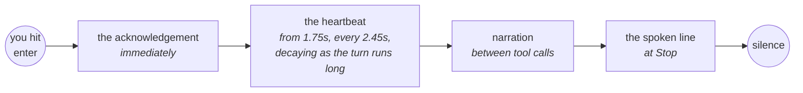

# The voice

Four sounds come out of this program, and they are four separate things with four separate switches. In the order you hear them in a turn:

| | When | Where it comes from |
|---|---|---|
| **The acknowledgement** | the instant you hit enter | its own small model call, or a cached phrase |
| **The heartbeat** | while the turn runs | a synthesized tick, on a timer |
| **Narration** | between tool calls | the prose blocks of the response, cleaned |
| **The spoken line** | when the turn ends | the model's own `<!-- TTS: -->` comment |

All four go through one queue and one player, so they never talk over each other.



Each has its own switch, and each can be off without touching the others.

## The switch

```bash
claude-voice on        # start speaking (off is the default)
claude-voice off       # stop, and silence anything playing right now
claude-voice status    # is it on? which session does it speak in?
claude-voice silence   # panic button: cut all sound now
```

++m++ or ++space++ in the HUD does the same thing, for the whole machine.

**Off is genuinely off.** While the voice is off the `UserPromptSubmit` hook injects nothing, so the model is never told to write the spoken line and you spend no tokens on summaries nobody will hear. Turning it on is what makes the instruction appear.

There is a second gate above the switch: **while no HUD is open, nothing of ours runs at all.** Closing the window does not turn the voice off — it suspends it, and opening one again picks up where the switch left it. See [Sessions and focus](sessions.md#the-hud-is-the-application).

## The spoken line

While the voice is on, a hook appends an instruction to every prompt telling the model to end its response with:

```html
<!-- TTS: one short spoken sentence -->
```

That marker is what gets spoken. **No marker, no sound.** The response body is never read aloud — markdown, diffs and file paths are unlistenable, and "slash home slash user slash repos" is why most read-it-aloud setups get abandoned in a week.

The model writes for the ear on purpose: the result rather than the procedure, "the config file" rather than the path. `<!-- TTS: SILENT -->` says nothing at all, which is the right answer to a turn with nothing to report.

!!! tip "The last marker wins"

    The extraction takes the *last* `<!-- TTS: -->` in the message, not the first. A response that quotes the marker while explaining it — this page, for instance — would otherwise have its prose example spoken instead of its actual summary.

### It is a summary, except when it should not be

Writing for the ear pulls towards the gist, and the gist is wrong when the question had an exact answer in it. Ask which services failed to start and the screen lists three names while the voice says "three, one more than yesterday" — true, and useless to somebody who asked *which*.

So the shipped instruction overrides its own word limit for a concrete answer: a number, a name, a short list, a yes or no gets said out loud, at whatever length that takes. Past six items it says how many, names the first few, and hands the rest to the screen.

### Changing the register

The instruction is a config value, not a constant:

```toml
[instruction]
enabled = true
text = """
Voice output is ON: the user will HEAR this response, not read it.
End every response with a single-line HTML comment:
    <!-- TTS: one short spoken sentence -->
...
"""
```

Blank means "build it from the language pack", which is what ships. Make it terse, make it formal, make it a pirate — it is your ear. Each [language pack](languages.md) carries its own, so a switch to Spanish switches the instruction too.

## The acknowledgement

The line spoken the instant you hit enter, so a long turn does not open with a minute of silence.

```bash
claude-voice ack "and now the tests"   # what would be said, printed not spoken
```

It comes from its own small model call — `claude-haiku-4-5` by default, with a three-second timeout — and it is shown the last few turns of the spoken log as well as the prompt.

??? question "Why show it the history at all?"

    That call used to see one thing: the sentence just submitted. Handed six words it can only hand six back, so "try it again with the flag" came back as "Retrying with the flag" — a sentence with no content in it.

    Worse, a word dictation got wrong was repeated with total confidence, because there was nothing to notice it against. Reading the last `ack.context` turns is enough to name the actual work and to quietly read "bump" where the microphone heard "pump".

### It also decides whether to speak at all

Say hello and the answer arrives in about the time an acknowledgement of it takes to play, so you were told twice that nothing was happening.

The same call now answers `SILENT` for anything it could simply answer — a greeting, a yes or no, a question with no work behind it — and nothing plays: not the line, not the cached phrase. What still gets an acknowledgement is the turn that would otherwise open with a minute of silence, which is the turn it was written for.

The test is how long the *answer* takes, not how short the request was: "run the tests" is three words and several minutes.

A failed call is not a decline. If the model times out, the cached phrase plays as before.

### The settings

```toml
[ack]
enabled = true          # the acknowledgement at all
contextual = true       # ask the model; false uses the cached phrases only
model = "claude-haiku-4-5"
context = 6             # turns of spoken log sent with the prompt; 0 sends the prompt alone
timeout = 3.0           # past this, the cached phrase plays instead
skip_quick = true       # let the call answer SILENT and play nothing
max_words = 9
```

This is the one part of the program that sends anything anywhere — the prompt and, unless `context = 0`, some of what was said out loud. `contextual = false` uses the pre-synthesized phrases and makes no call; `enabled = false` skips the whole thing.

`claude-voice ack "some prompt"` prints what would be said, with how long the call took and how many turns it read — the way to choose `ack.context` for your own connection, since a late acknowledgement is worse than a vague one.

### The cache

The fallback phrases are synthesized once, per language, into `~/.config/claude-voice/acks/<preset>/`. Rebuild them after changing the voice or the phrase list:

```bash
claude-voice build-acks          # the active language
claude-voice build-acks es       # a named one
```

The cache is kept per preset because it is indexed by position — one shared directory would play the old language's wav while the spoken log recorded the new language's words.

## The heartbeat

A soft tick, so a five-minute turn does not sound like a crash.

```toml
[thinking]
enabled = true
delay = 1.75            # nothing sounds before this — short turns stay silent
interval = 2.45         # seconds between ticks
style = "soft"          # soft | double | low
max_run = 150           # hard cap
agent_interval = 4.0    # tick spacing while subagents are running
agent_max_run = 1800
```

Two details worth knowing. It **decays**: past 45 seconds the interval grows by a factor of 1.6 every half minute, up to 8 seconds, so a long turn gets quieter rather than more insistent. And it **skips a tick while anything else is playing**, so it never interrupts a spoken line.

### The subagent tick

When the turn is waiting on subagents it plays a different sound, at a flat interval that does not decay. Waiting on agents looks the same as thinking from the inside, but it is not the same thing — if agents are out, the wait has an owner, and the HUD puts a small reactor in orbit for each of them.

Liveness is inferred from the agents' own transcript files rather than from the tool call, because the tool returns in about a second and a half while the agent keeps working.

```bash
claude-voice build-ticks         # regenerate the sounds
claude-voice build-ticks double  # in another style
```

!!! warning "The tick outliving the answer"

    The `Stop` hook is what kills it, so a session that died mid-turn — out of tokens, a hang, ++ctrl+c++ — leaves it running. It caps itself, or `claude-voice silence` ends it now.

## Narration

Progress spoken between tool calls, from the `MessageDisplay` hook, so the long middle of a turn is not silence.

```toml
[narrate]
enabled = true
word_limit = 50         # spoken whole below this; trimmed to a lead-in above
max_per_turn = 12       # notices per turn
min_words = 3           # below this, discarded as noise
```

The text is cleaned before it is spoken: code fences, tables and links go, paths are reduced to a basename, hashes are dropped. A block that carries the `<!-- TTS: -->` marker is skipped — that one belongs to the `Stop` hook, and speaking it twice is the failure this avoids.

Drop the `MessageDisplay` entry from your hooks if you only want the final line.

Tune it without editing the config:

```bash
claude-voice narrate --tune 40 8    # word_limit, max_per_turn
claude-voice narrate --show
```

## One queue, one player

Acknowledgement, narration, final answer and tick all enqueue and return immediately — a hook that waited for audio would stall your session. A single locked player process plays them in order, one at a time.

```bash
claude-voice queue --status
claude-voice queue --drain      # empty it
```

The final line **flushes** the same session's pending items when it enqueues, so the answer does not arrive behind three narration lines about how it was reached. Other sessions' queued audio is left alone.

Every item that reaches the player is written to the [spoken log](history.md) as it is played — which is why the log has the narration and the acknowledgement in it, and the transcript does not.

## The expressive provider

Piper is flat by construction and always will be — it is a VITS model, phonemes in and one learned delivery out, with no input where "laugh" could go. Upstream's own answer to emotion is to train a separate speaker per emotion.

So there is a second provider:

```toml
[tts]
provider = "chatterbox"    # piper (default) | chatterbox
```

Chatterbox Turbo runs locally on the CPU, is MIT for both its code and its weights, needs no account, and takes emotion as square-bracket tags written inline in the spoken line:

```html
<!-- TTS: [sigh] Fourth attempt on the same failure. -->
```

Nineteen tags are available — `[laugh]`, `[chuckle]`, `[sigh]`, `[groan]`, `[gasp]`, `[cough]`, `[sniff]`, `[shush]`, `[clear throat]`, `[sarcastic]`, `[dramatic]`, `[angry]`, `[happy]`, `[crying]`, `[fear]`, `[surprised]`, `[whispering]`, `[narration]`, `[advertisement]`.

It costs about a second or two more per line than Piper. [Performance](performance.md#the-voice-piper-against-chatterbox) has the numbers.

### Setting it up

```bash
claude-voice voice --fetch    # the weights, about 490 MB, once
claude-voice voice --build    # clone your own Piper voice for it to imitate
claude-voice voice            # is it ready?
claude-voice voice --say "Done, the tests pass. [chuckle]"
```

Then set `tts.provider`. `claude-voice doctor` reports the provider and says which step is missing if either is.

### It clones the voice you already have

Chatterbox imitates whatever reference clip it is handed, so `--build` has **Piper speak one sentence and clones that**. The consequences are all good ones:

- **The timbre does not change** when you switch provider. The voice you are used to simply gains the ability to sigh.
- **No voice asset ships** and no attribution is owed, because the reference is Piper's own MIT-licensed output.
- **It follows the language switch.** Build it under the `es` preset and you get a Chatterbox that sounds like *your* Spanish voice, because that is what it was cloned from. One file per preset.

A shorter reference is also a faster one — its length becomes prompt tokens on every later generation — so the clip is deliberately brief.

### Tags are stripped for anything that cannot hear them

This matters more than it sounds. Piper has no concept of a tag, so an unstripped one is phonemized as ordinary words: `[sigh]` comes out as **"size"**, and adds most of a second.

So any provider that does not declare tag support has them removed first, using a vocabulary that lives in the configuration rather than in the expressive provider — a broken or missing provider must not be able to switch the stripping off. Only *known* tags go: `Version [1.2.3] shipped.` survives intact.

The model is only told about tags when something can actually hear them. Under Piper the guidance is not injected at all, so no prompt is spent describing a vocabulary whose every use would be stripped again.

### Choosing how often it acts

```toml
[tags]
enabled = true
vocabulary = []        # blank uses the full list
instruction = ""       # blank uses the built-in wording
```

The built-in wording asks for restraint — "most lines need none" — which in practice produces very few. `tags.instruction` is where you change that, and it is a per-language value like the rest of the register. Asking for one on *every* line works best if you keep `[narration]` in the list as the neutral option, so a plain number still sounds plain.

### If it cannot run

It falls back to Piper and says so on stderr. That is a deliberate decision rather than an exception handler: a voice that goes silent when a model file is missing is worse than one that sounds flat.

## Synthesis

Piper, locally, on the CPU. The voice model is a pair of files — an `.onnx` and its `.onnx.json` — under `~/.local/share/piper-voices/`.

```toml
[tts]
voice_model = "~/.local/share/piper-voices/en_US-amy-medium.onnx"
length_scale = 1.06     # >1 is slower — butler pacing lives here
primary_voice = "en-us" # the espeak-ng voice that phonemizes the line
foreign_voice = ""      # a second one, spliced in for the terms you list
max_chars = 400
```

If the named model is missing, another voice of the same language on disk is substituted rather than failing silent — preferring `high` over `medium` over `low`.

`foreign_voice` and the pronunciation tables are what handle technical vocabulary in a non-English voice; that is [Pronunciation](pronunciation.md).

## Testing it without a session

```bash
claude-voice say "test one two"     # synthesize and play, ignoring the switch
claude-voice pron say "I merged into main"
```

`say` bypasses the switch and the HUD gate deliberately: when nothing comes out, the question is whether the audio path works at all, and a command that respects the switch cannot answer it.

## Failing silent

A broken voice must never break coding. Every hook catches broadly and exits zero, and a hook that cannot synthesize, cannot find a device, or cannot reach the model writes a line to `~/.config/claude-voice/speak.log` and gets out of the way.

That is also why "nothing was spoken" is a log question rather than a mystery — [Troubleshooting](troubleshooting.md) reads that file line by line.
